# IaaS (Infrastructure-as-a-Service)

 Infrastructure-as-a-Service yang biasa disebut hanya sebagai “IaaS,” adalah bentuk komputasi awan yang memberikan komputasi dasar, jaringan, dan sumber daya penyimpanan kepada konsumen sesuai permintaan, melalui internet, dan dengan pembayaran sesuai permintaan. Anda-pergi dasar. IaaS memungkinkan pengguna akhir untuk menskalakan dan mengecilkan sumber daya sesuai kebutuhan, mengurangi kebutuhan pengeluaran modal di muka yang tinggi atau infrastruktur "milik sendiri" yang tidak perlu, terutama dalam kasus beban kerja yang "berduri". Berbeda dengan PaaS dan SaaS (bahkan model komputasi yang lebih baru seperti container dan tanpa server), IaaS menyediakan kontrol sumber daya tingkat terendah di cloud.

IaaS muncul sebagai model komputasi populer di awal 2010-an, dan sejak saat itu, ia telah menjadi model abstraksi standar untuk berbagai jenis beban kerja. Namun, dengan munculnya teknologi baru, seperti wadah dan tanpa server, dan peningkatan terkait pola aplikasi layanan mikro, IaaS tetap menjadi dasar tetapi berada di bidang yang lebih ramai dari sebelumnya.

Referensi: https://www.ibm.com/cloud/learn/iaas

1. Download virtualbox terlebih dahulu

[Link Download Virtual Box](https://www.virtualbox.org/wiki/Downloads)
pilih Windows Hosts

2. Download Ubuntu
[Link Download](https://ubuntu.com/download/desktop)

3. Install Virtual Box
[Bisa lihat disini](https://www.nesabamedia.com/cara-install-ubuntu-di-virtualbox/)

4. Setelah selesai unduh file Virtual Box dengan kapasitas kurang lebih 2 GB, run file tersebut dan klik NEXT

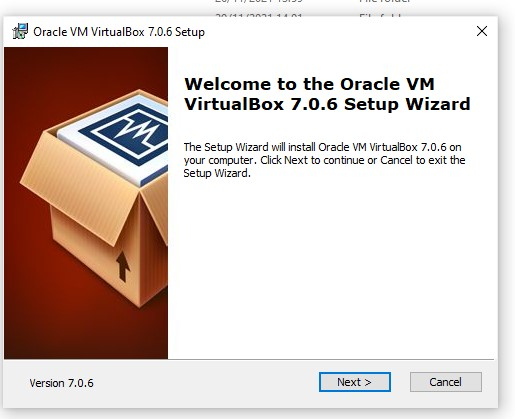

5. Kemudian Proses Instalasi

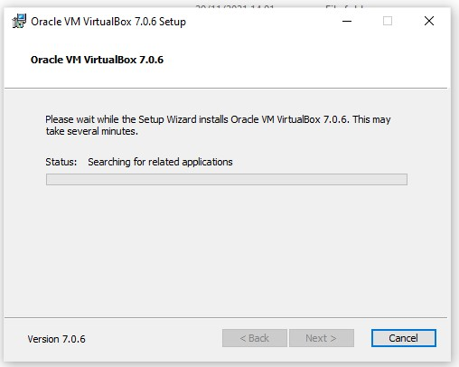

6. Setelah selesai instalansi VM, kemudian pilih menu NEW (simbol matahari warna biru)

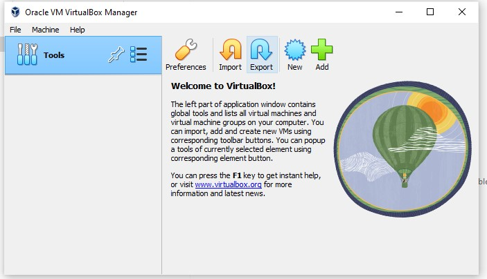

7. Create Virtual Machine

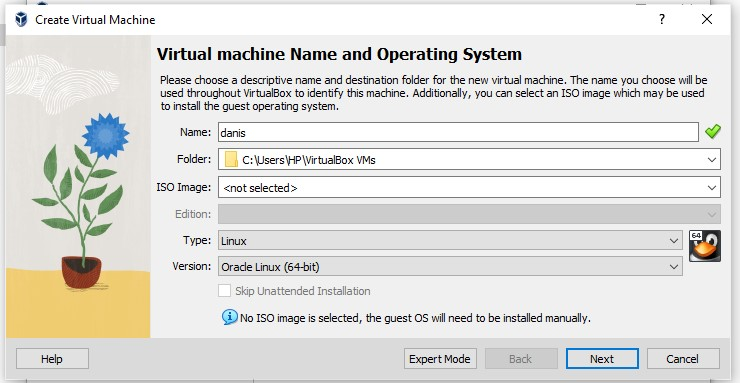

- Isian sebagai berikut: 
- Name : Danis
- Folder : C:\Users\HP\VirtualBox VMs 
- Type: Linux 
- Version: Ubuntu (64-bit), 
- pilih Create a virtual hard disk now, OK

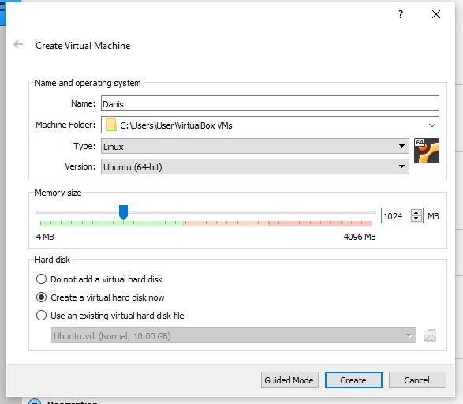

- Pilih file location bebas, pilih yang VDI (Virtual Disk Image)

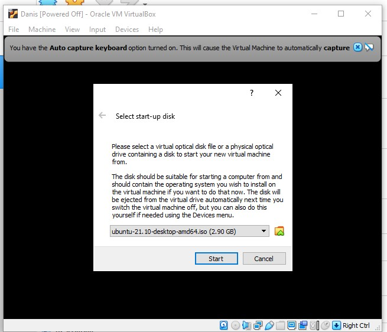

- Tampilan Selesai

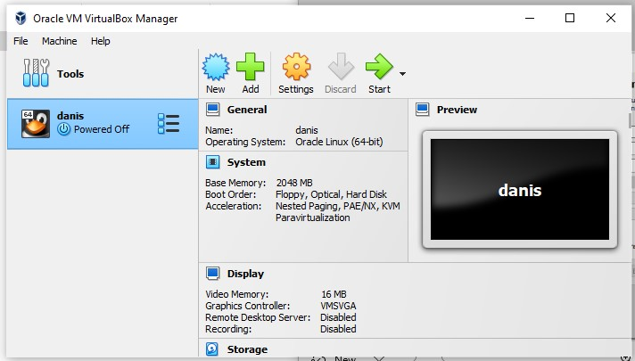

Lalu Klik Start untuk dan jalankan (Simbol Anak Panah Kekanan Warna Hijau)

Setelah Start tampilan sebagai berikut,

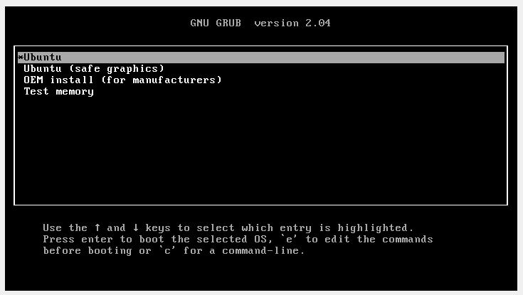

Pilih Ubuntu, Kemudian tampialn selanjutnya sebagai berikut:

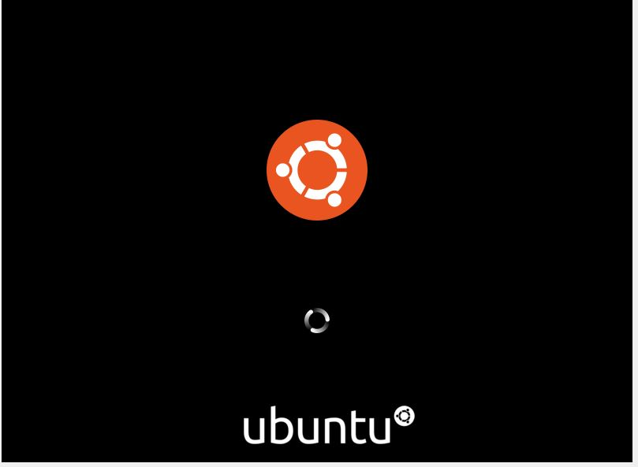

Kemudian Tampilan berganti sebagai berikut, pilih Bahasa English, Insyall Ubuntu

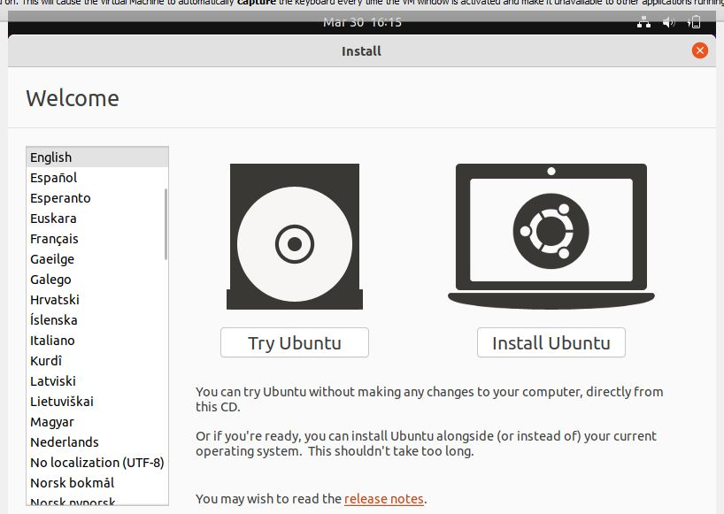

Tampilan Ubuntu _Installation Complete_

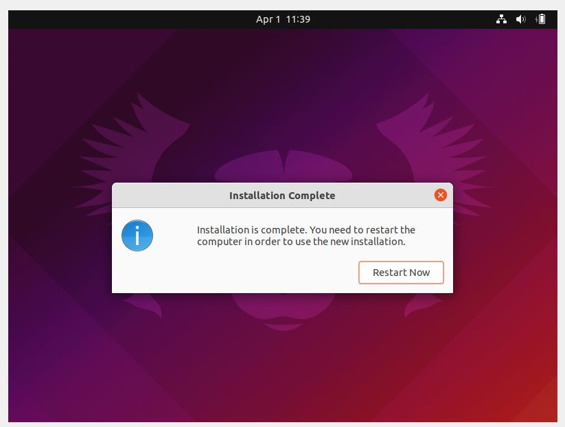

Sebagai informasi Bapak Dosen, mohon maaf sebelumnya saya sudah mencoba install beberapa kali Ubuntu/VM Machine di laptop dan ganti laptop juga, tetapi prosesnya hanya sampai disini, saat proses loading tidak pernah berhasil sampai halamam program VirtualBoxnya.

Berikut langkah-langkah install git di OS Linux Ubuntu yang saya pahami, tetapi mohon maaf karena belum bisa praktikan langsung karena proses instalasinya saya tidak berhasil sampai menu program.

Terima kasih.

5. Untuk menginstall git di OS LINUX UBUNTU
- bukalah terminal distart->pilih terminal
- ketik ~ $ `sudo apt git install`

6. Selanjutnya install devstack 
~$ `sudo useradd -s /bin/bash -d /opt/stack -m stack`
~$ `echo "stack ALL=(ALL) NOPASSWD: ALL" | sudo tee /etc/
sudoers.d/stack`
~$ `sudo -u stack -i`

7. Clone file devstack dengan github

~ $ `sudo apt install git`

Membuat `local.config`

Buat file `local.conf` dengan empat kata sandi yang telah ditetapkan di root devstack git repo.

 [local|localrc]
- ADMIN_PASSWORD=secret
- DATABASE_PASSWORD=~$ADMIN_PASSWORD
- RABBIT_PASSWORD=~$ADMIN_PASSWORD
- SERVICE_PASSWORD=~$ADMIN_PASSWORD

8. Setting `IP host` terlebih dahulu di `stack.rc` jika gagal dengan notif

9. Setting `di stack.sh` pada line : 234

10. Selanjutnya ketik ~$ `./stack.sh`