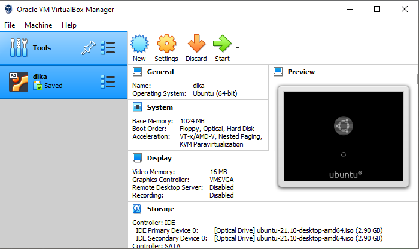
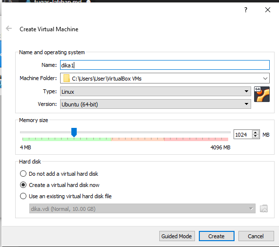
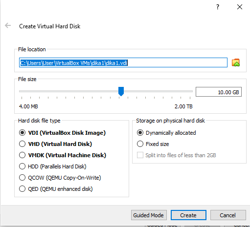
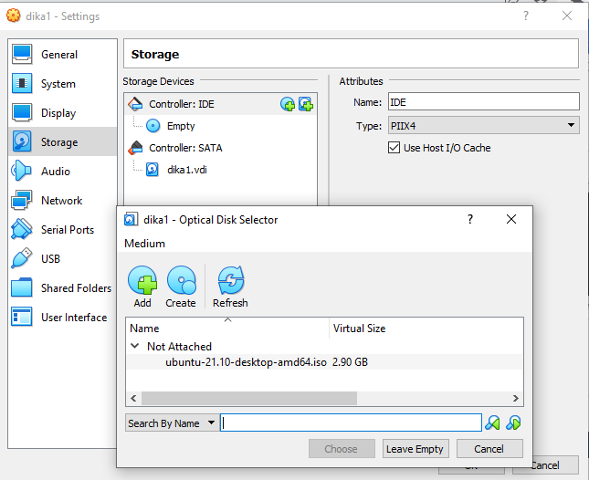
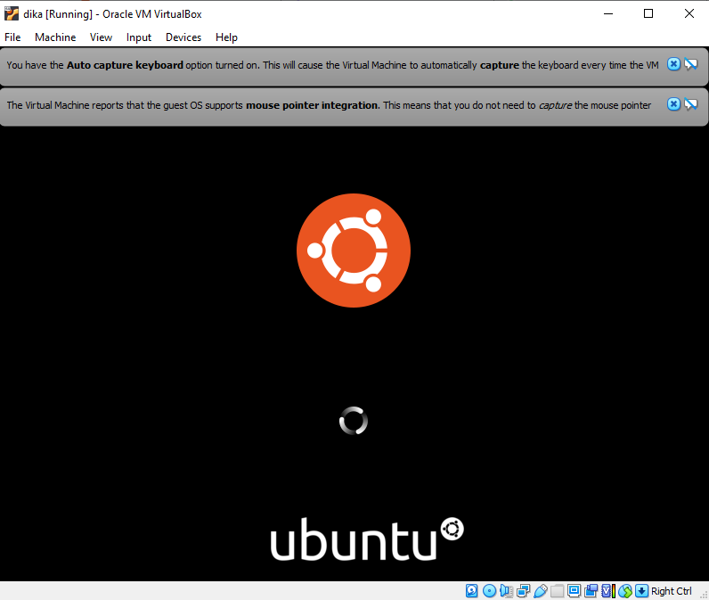

# IaaS (Infrastructure-as-a-Service)

yang biasa disebut hanya sebagai “IaaS,” adalah bentuk komputasi awan yang memberikan komputasi dasar, jaringan, dan sumber daya penyimpanan kepada konsumen sesuai permintaan, melalui internet, dan dengan pembayaran sesuai permintaan. Anda-pergi dasar. IaaS memungkinkan pengguna akhir untuk menskalakan dan mengecilkan sumber daya sesuai kebutuhan, mengurangi kebutuhan pengeluaran modal di muka yang tinggi atau infrastruktur "milik sendiri" yang tidak perlu, terutama dalam kasus beban kerja yang "berduri". Berbeda dengan PaaS dan SaaS (bahkan model komputasi yang lebih baru seperti container dan tanpa server), IaaS menyediakan kontrol sumber daya tingkat terendah di cloud.

IaaS muncul sebagai model komputasi populer di awal 2010-an, dan sejak saat itu, ia telah menjadi model abstraksi standar untuk berbagai jenis beban kerja. Namun, dengan munculnya teknologi baru, seperti wadah dan tanpa server, dan peningkatan terkait pola aplikasi layanan mikro, IaaS tetap menjadi dasar tetapi berada di bidang yang lebih ramai dari sebelumnya.

Referensi: https://www.ibm.com/cloud/learn/iaas

1. Download virtualbox terlebih dahulu

[Link Download Virtual Box](https://www.virtualbox.org/wiki/Downloads)
pilih Windows Hosts

2. Download Ubuntu
[Link Download](https://ubuntu.com/download/desktop)

3. Install Virtual Box
[Bisa lihat disini](https://www.nesabamedia.com/cara-install-ubuntu-di-virtualbox/)

4. Install Ubuntu
- Klik New 

- Isi nama bebas, 
Type: Linux, 
Version: Ubuntu (64-bit), 
pilih Create a virtual hard disk now, 
OK

- Pilih file location bebas, pilih yang VDI (Virtual Disk Image)

- Tampilan Selesai

Lalu Klik Start untuk dan jalankan

5. Untuk menginstall git di OS LINUX UBUNTU
- bukalah terminal distart->pilih terminal
- ketik $ `sudo apt git install`

6. Selanjutnya install devstack 
-	$ `sudo useradd -s /bin/bash -d /opt/stack -m stack`
-	$ `echo "stack ALL=(ALL) NOPASSWD: ALL" | sudo tee /etc/
sudoers.d/stack`
-	$ `sudo -u stack -i`
7. Clone file devstack dengan github

Membuat local.conf¶
Buat file local.conf dengan empat kata sandi yang telah ditetapkan di root devstack git repo.

 [[local|localrc]]
ADMIN_PASSWORD=secret
DATABASE_PASSWORD=$ADMIN_PASSWORD
RABBIT_PASSWORD=$ADMIN_PASSWORD
SERVICE_PASSWORD=$ADMIN_PASSWORD

8. Setting IP host terlebih dahulu di stack.rc jika gagal dengan notif
9. Setting di stack.sh pada line : 234
10. Selanjutnya ketik $ `./stack.sh`

