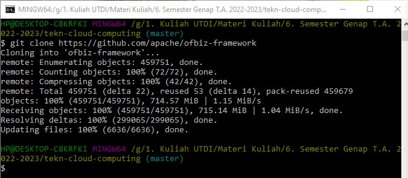
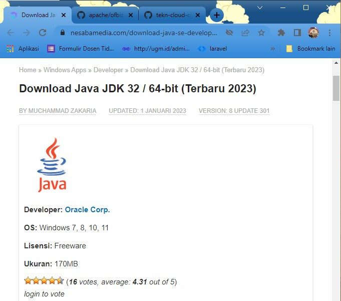
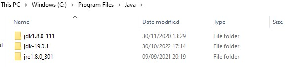
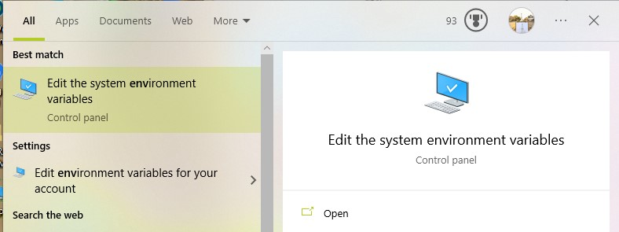
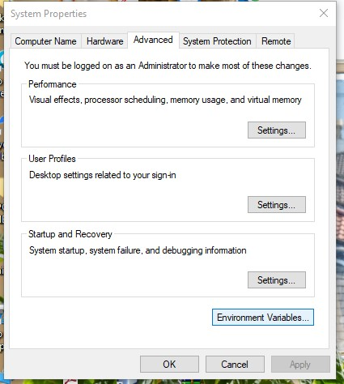
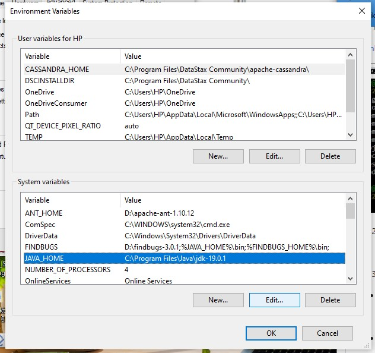
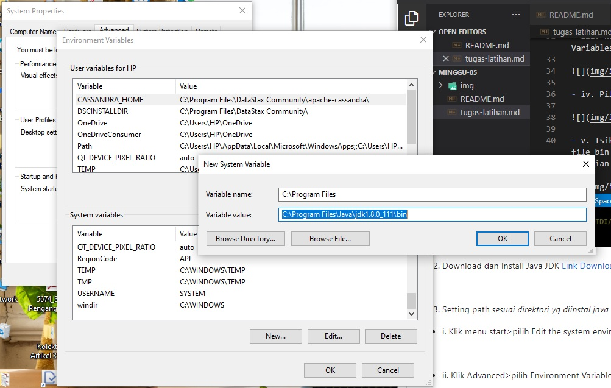
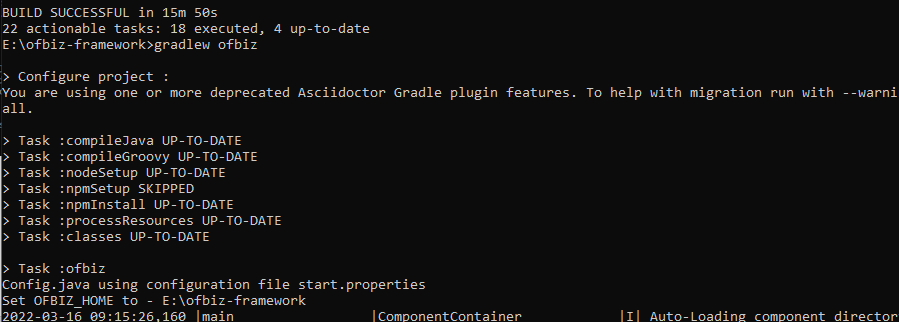
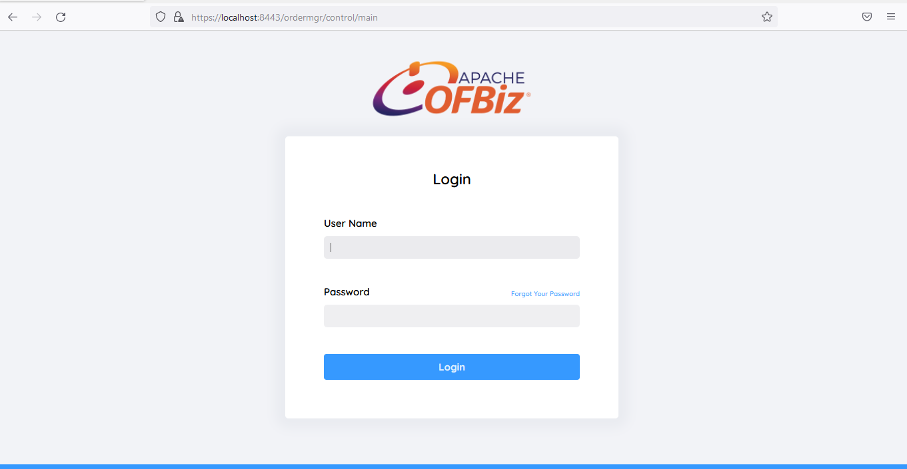
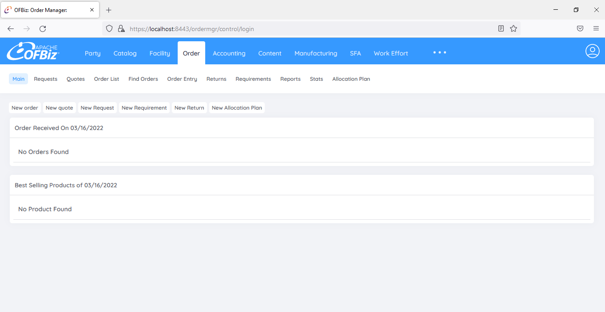

# Apache OFBiz

Apache OFBiz adalah produk _open source_ yang dirancang khusus untuk otomatisasi proses perusahaan yang mencakup komponen kerangka kerja dan aplikasi bisnis untuk `ERP` (_Enterprise Resource Planning_), `CRM` (_Customer Relationship Management_), `E-Business` / `E-Commerce`, `SCM` (_Supply Chain Management_), `MRP` (_Manufacturing Resource Planning_), `MMS`/`EAM` (Maintenance Management System/Enterprise Asset Management). Proyek Apache OFBiz adalah bagian dari The Apache Software Foundation dan dilisensikan di bawah Apache License Version 2.0. Awalnya OFBiz berdiri untuk terbuka untuk bisnis _Open For Business_. Apache OFBiz menyediakan fondasi sistem dan titik awal untuk solusi perusahaan yang andal, aman, dan skalabel. Perusahaan dapat menggunakannya, menyesuaikannya atau menggunakannya sebagai kerangka untuk mengimplementasikan kebutuhan bisnis mereka. Dengan OFBiz, sebuah organisasi dapat segera dimulai tanpa biaya penyebaran dan pemeliharaan besar untuk sistem otomatisasi perusahaan tradisional. Seiring pertumbuhan bisnis, mereka dapat memperluas fungsi untuk memenuhi kebutuhan mereka yang lebih canggih. Apache OFBiz menawarkan banyak fungsi bisnis, termasuk: `e-commerce`, manajemen katalog yang efisien, promosi & manajemen harga, manajemen pesanan aman untuk penjualan & pembelian, manajemen pelanggan (bagian dari manajemen pihak umum), manajemen gudang total, mencakup bagian seperti pemindahan stok secara otomatis, pemilihan _batch_, dan pengemasan & pengiriman, akuntansi untuk berbagai tujuan seperti faktur, akun pembayaran & penagihan, dan aset tetap, manajemen manufaktur lengkap, manajemen usaha yang umum mencakup bidang utama seperti acara, tugas, proyek, dan permintaan serta pengelolaan konten aman yang mencakup area seperti konten produk, situs web, konten umum, blog, dan forum.

Referensi: https://ofbiz.apache.org/ https://www.predictiveanalyticstoday.com/free-open-source-enterprise-resource-planning-erp-software/ https://blog.capterra.com/free-open-source-erp-software/. http://e-journal.stmikkomputama.ac.id/index.php/jtb/article/view/4

1. Clone file OFBiz terlebih dahulu

[Link Github OFBiz](https://github.com/apache/ofbiz-framework)

2. Download dan Install Java JDK
[Link Download](https://www.nesabamedia.com/download-java-se-development-kit-jdk/)

- folder file JDK

3. Setting path _sesuai direktori yg diinstal java_

- i. Klik menu start>pilih Edit the system environment variables

- ii. Klik Advanced>pilih Environment Variables

- iii. Kemudian klik edit di bagian Systems Variables klik path>edit

- iv. Pilih menu `New`

- v. Isikan sesuai dengan diektori java yg ada file bin nya lalu copy alamat bin tersebut, kemudian pilih menu `OK`

4. Proses aktifasi OFBiz `gradlew cleanAll loadAll`

5. Untuk menjalankan OFBiz ketikan `gradlew ofbiz`

6. Masuk menu Apache OFBiz

- Username : danis
- Password : ofbiz

7. Halaman dashboard OFBiz
