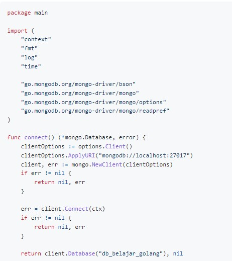
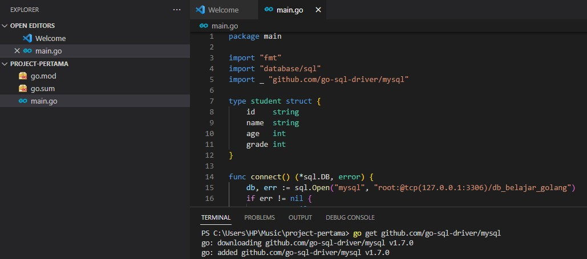
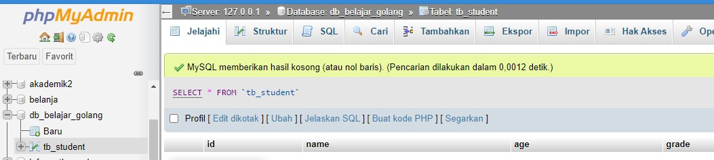
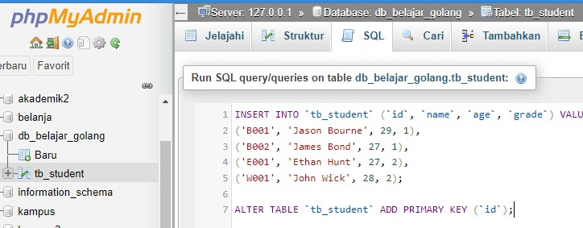
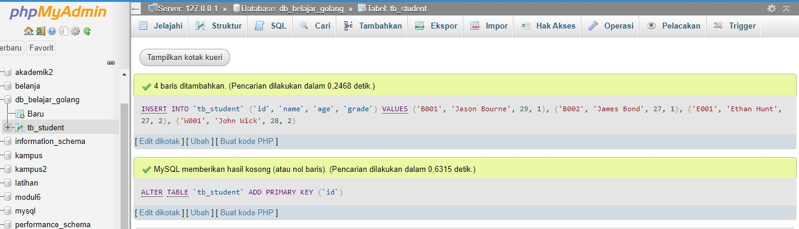
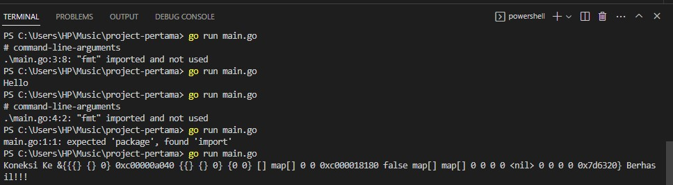
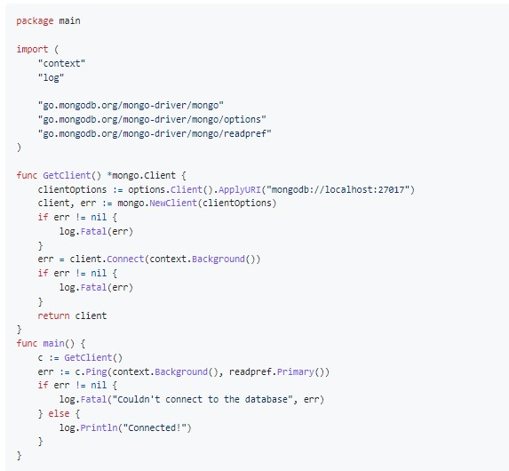
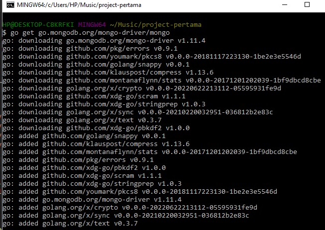
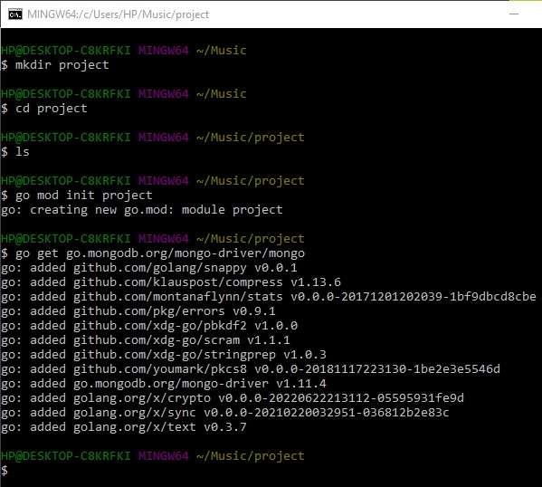

## 205611034 Danis Apriyanto

# Data as a service

Dalam komputasi, data sebagai layanan, atau DaaS, adalah istilah yang digunakan untuk menggambarkan perangkat lunak berbasis cloud yang digunakan untuk bekerja dengan data, seperti mengelola data di gudang data atau menganalisis data dengan kecerdasan bisnis. Ini diaktifkan oleh perangkat lunak sebagai layanan (SaaS).[1] Seperti semua teknologi "sebagai layanan" (aaS), DaaS dibangun di atas konsep bahwa produk datanya dapat diberikan kepada pengguna sesuai permintaan, [2] terlepas dari pemisahan geografis atau organisasi antara penyedia dan konsumen. Arsitektur berorientasi layanan (SOA) dan meluasnya penggunaan API telah menjadikan platform tempat data berada sebagai tidak relevan.[3]

Data sebagai layanan sebagai model bisnis adalah konsep ketika dua atau lebih organisasi membeli, menjual, atau memperdagangkan data yang dapat dibaca mesin dengan imbalan sesuatu yang bernilai.[4]

# Sofware Yang Diperlukan

* [Download GO](https://go.dev/doc/install)

* [Download MySQL](https://dev.mysql.com/downloads/installer/)

* [Download MonggoDB](https://www.mongodb.com/try/download/community)

## Implementasi Program Go Untuk Membaca Data Pada Mysql

Golang connection to PHPMySQL

1. Buat direktori `mkdir project-pertama`

2. Masuk ke direktori `cd project-pertama`

3. Untuk membuat go.mod `go mod init project-pertama`

4. Cek file terlebih dahulu `ls`

5. Setting path variabel `dir`

Install gopath

## Koneksi mysql

Untuk kode koneksi ke mysql sebagai berikut,

1. Instalasi driver terlebih dahulu ketik `go get github.com/go-sql-driver/mysql`

2. Buat database dan tabel di MySQL

3. Buat tabel

4. isikan data

5. Untuk menjalankan golang ketikan `go run main.go`

6. Masuk ke mongodb, 

instalasi ketikan `go get go.mongodb.org/mongo-driver/mongo`

7. Membuat project

