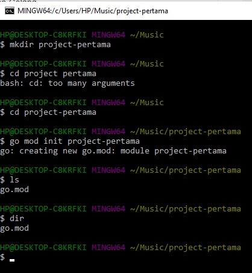

# Data as a service

Dalam komputasi, data sebagai layanan, atau DaaS, adalah istilah yang digunakan untuk menggambarkan perangkat lunak berbasis cloud yang digunakan untuk bekerja dengan data, seperti mengelola data di gudang data atau menganalisis data dengan kecerdasan bisnis. Ini diaktifkan oleh perangkat lunak sebagai layanan (SaaS).[1] Seperti semua teknologi "sebagai layanan" (aaS), DaaS dibangun di atas konsep bahwa produk datanya dapat diberikan kepada pengguna sesuai permintaan, [2] terlepas dari pemisahan geografis atau organisasi antara penyedia dan konsumen. Arsitektur berorientasi layanan (SOA) dan meluasnya penggunaan API telah menjadikan platform tempat data berada sebagai tidak relevan.[3]

Data sebagai layanan sebagai model bisnis adalah konsep ketika dua atau lebih organisasi membeli, menjual, atau memperdagangkan data yang dapat dibaca mesin dengan imbalan sesuatu yang bernilai.[4]

# Sofware Yang Diperlukan

* Download GO
https://go.dev/doc/install

* Download MySQL
https://dev.mysql.com/downloads/installer/

* Download MonggoDB
https://www.mongodb.com/try/download/community

## 1. Implementasi Program Go Untuk Membaca Data Pada Mysql

