## 205611034 Danis Apriyanto

# Virtual Machine (VM)

Apa itu _virtual machine_ (VM) adalah sebuah emulasi dari sebuah sistem komputer. Secara sederhana, _virtual machine_ membuat kita bisa membagi _resource hardware_ dari satu _hardware_ fisik menjadi beberapa sistem komputer.

Sebagai contoh, kita memiliki satu PC yang memiliki prosesor dengan 4 core, RAM sebesar 8 GB serta hardisk 500GB misalnya. Tanpa VM tentu kita hanya bisa menginstall 1 OS atau beberapa OS tapi tak bisa berjalan bersamaan. Dengan VM, kita bisa membagi sistem komputer menjadi dua masing-masing memiliki prosesor 2 core, RAM 4GB, serta hardisk 250GB dan tentu saja pembagian _resource hardware_ tidak harus sama rata. Dengan ini, maka kita dapat menginstall OS di setiap sistem komputer dan dapat menjalankannya secara bersamaan sehingga kita seolah memiliki 2 PC yang berbeda.

Teknologi ini sering digunakan untuk server dan memunculkan istilah _Virtual Private Server_ (VPS) tapi sedikit pula digunakan oleh app developer karena _project_ yang sedang dikerjakannya memiliki _platform_ yang berbeda dengan _platform_ yang dimiliki.

Keunggulan VM _Resource hardware_ yang eksklusif sehingga tidak terganggu jika ada aplikasi yang lain tiba-tiba membutuhkan _resource_ yang tinggi, Memiliki _management tools_ dan _security tools_ yang sudah matang dan secara umum memiliki tingkat keamanan sedikit lebih tinggi bila dibandingkan dengan _container_.

Apa Itu _Container_ Berbeda dari VM, _container_ adalah sebuah virtualisasi OS yang dapat membungkus suatu aplikasi beserta _dependency_ dan _environment_ nya. Setiap _container_ ini memiliki proses yang terisolir, sehingga tidak mengganggu _host_ OS ataupun _container_ yang lain. Prinsip _container_ ini mirip dengan kontainer yang ada di kapal kargo di mana kapal kargo tersebut diibaratkan sebagai sistem komputer.

Jika dibandingkan dengan VM, secara pengaturan kontainer lebih mudah. Hal ini disebabkan karena konsep berbagi _resource hardware_ dari _container_ lebih fleksibel bila dibandingkan VM. Sebagai contoh, tadi disebutkan bahwa kita mempunyai 1 PC dengan 4 Core, RAM 8 GB, dan _storage_ sebesar 500GB. Katakanlah kita mempunyai 2 _container_ dengan kebutuhan RAM berbeda. Beberapa aplikasi dalam _container_ A membutuhkan RAM 5GB sedangkan aplikasi dalam _container_ B membutuhkan RAM 2GB. Dengan _container_, kita tak perlu mengatur kebutuhan _hardware resource_ setiap _container_ karena berada dalam satu sistem komputer. Sementara jika kita memakai VM dengan _hardware resource_ yang sudah kita bagi sama rata seperti disebutkan di contoh sebelumnya, kita tidak mungkin memasang aplikasi di _container_ A di salah satu sistem komputer karena RAM maksimal yang bisa kita pakai hanyalah 4GB.

Faktor portabilitas juga menjadi kelebihan yang dimiliki oleh _container_. Para developer bisa membagikan _container_ dengan format ISO image ke setiap perangkat yang dia pakai ataupun ke developer lain.

# Sofware Yang Diperlukan

* [Download Docker](https://docs.docker.com/get-docker/)

1. Install docker terlebih dahulu

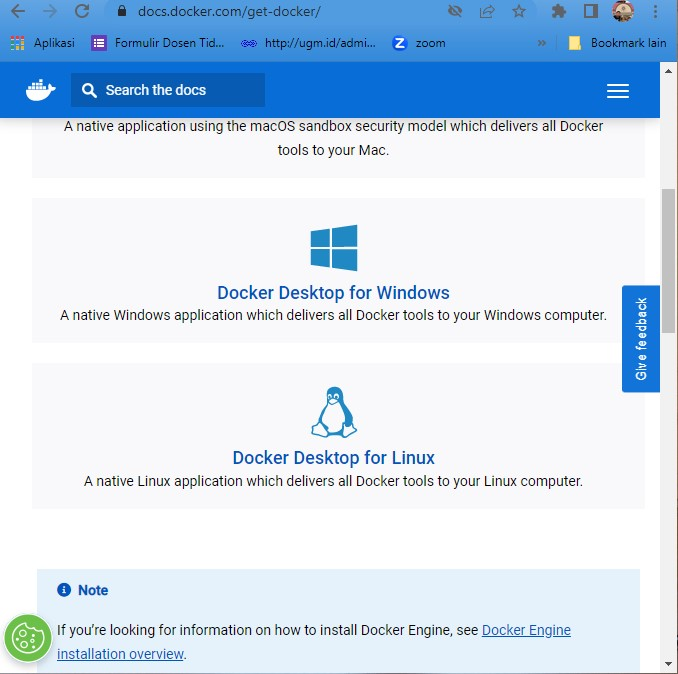

2. Setting windows security app

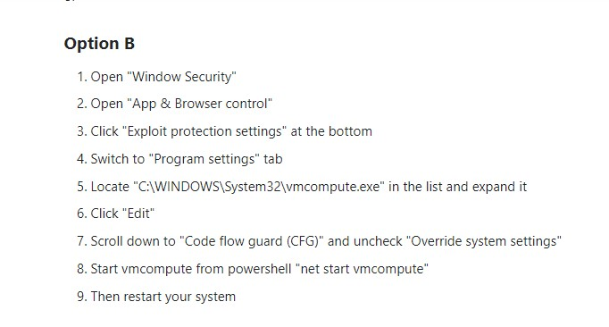

3. Install switch demo

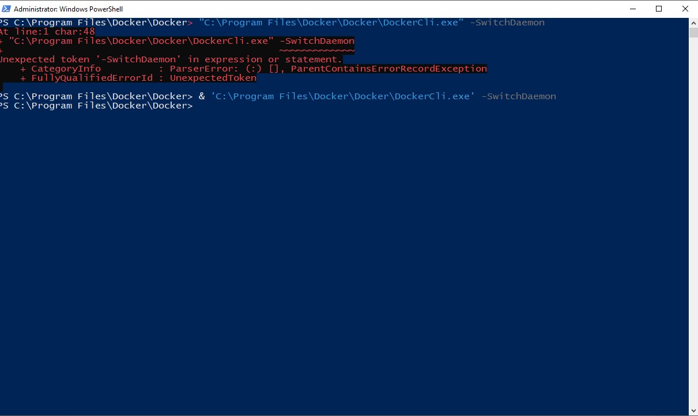

4. Proses install Docker, tunggu sampai proses selesai, setelah selesai klik>Finish

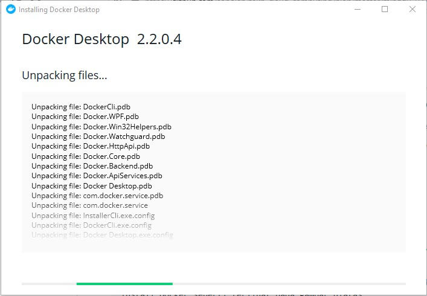

5. Proses Running aplikasi docker

halaman depan aplikasi docker

6. Kemudian masuk ke `Command Prompt`

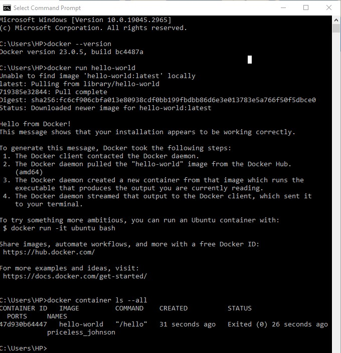

Langkah Selanjutnya 

a. ketikan `docker --version`
b. ketikan `docker run hello-world`
c. ketikan `docker container ls --all`

7. Kemudian langkah selanjutnya melakukan clonning repositori dari Git untuk mengambil bulletin-board pada docker.

ketikan

https://github.com/dockersamples/node-bulletin-board

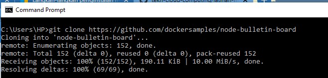

8. Kemudian masuk pada direktori `node-bulletin-board-app.`
ketikan

`cd node-bulletin-board/bulletin-board-app`

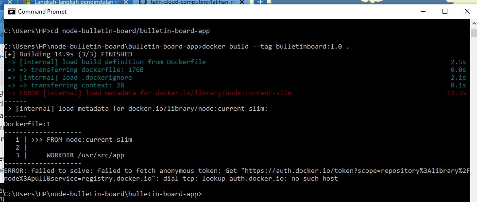

7. Login into Docker>Login/Aktifasi akun baru menggunakan email

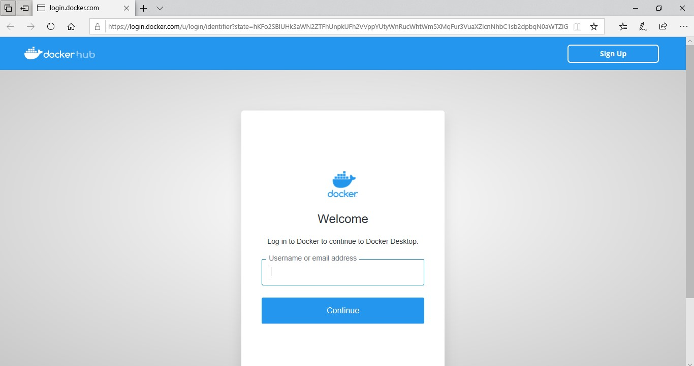

8. Mengambil image

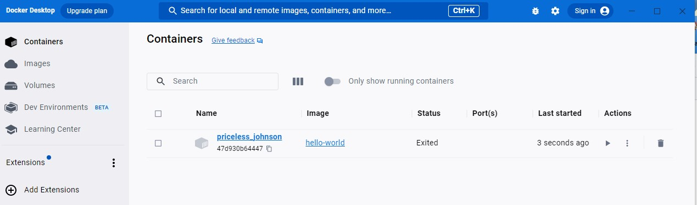

* Search ketik "hello-world"

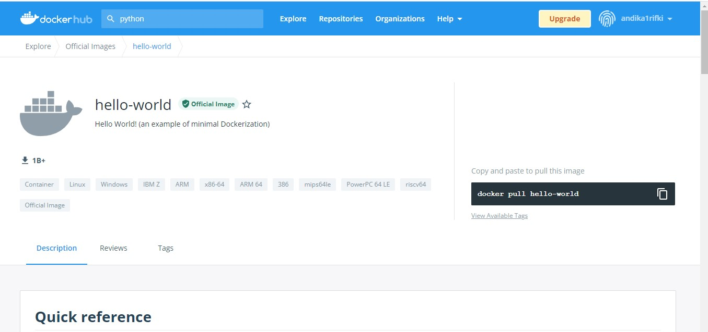

9. Selanjutnya di github ketik perintah `docker pull hello-world`

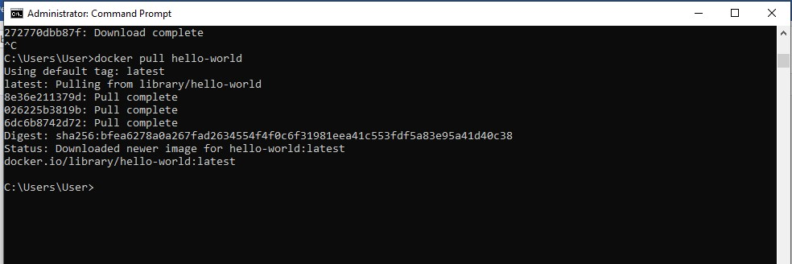

Kemudian cek repository "docker images"

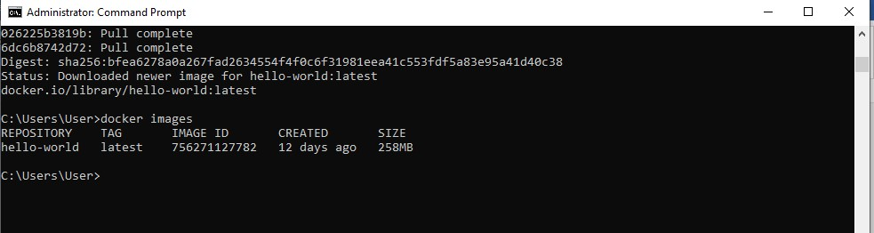

10. Menjalankan docker run dengan ketikan `docker run hello-world`

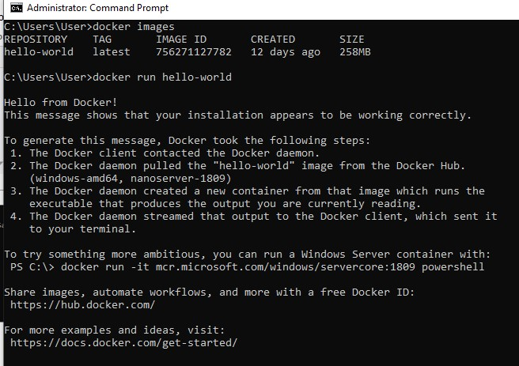