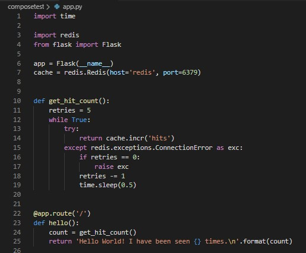
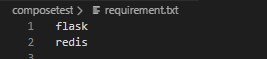
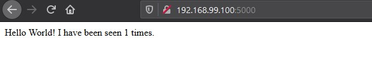

## Penjelasan Praktikum Teknologi Cloud Computing Minggu ke 08

1. Terlebih dulu membuat direktori baru untuk project dan kemudian masuk pada direktori tersebut, seperti pada gambar dibawah ini :

Perintah yang digunakan yakni :
* `mkdir composetest`
* `cd composetest`

2. Selanjutnya membuat file baru pada project dengan nama `app.py` file python ini akan menghubungkan ke jaringan redis yang nantinya dapat diakses. Dengan menambahkan script seperti pada gambar dibawah ini:

3. Kemudian membuat file `txt` dengan nama _requirements_ dan mengisihkan _script_ pada file tersebut, seperti dibawah ini:

4. Kemudian membuat file baru dengan nama `DockerFile` dan kemudian mengisihkan _script_ seperti dibawah ini:

    Pada _script_ diatas akan berguna untuk mengeksekusi beberapa perintah yang berada pada beberapa file sebelumnya.

5. Dan kemudian untuk selanjutnya membuat file `yml`, dengan nama `docker-compose`. File ini akan berguna sebagai wadah untuk merujuk pada port 5000 yang nantinya dapat diakses. Seperti pada gambar dibawah ini:

    _Script_ diatas merupakan _script_ yang akan menjadi layanan dengan menggunakan _port_ _default_ untuk `server web Flask 5000`.

6. Selanjutnya melakukan _running_ untuk project/direktori yang dibuat tadi dengan menggunakan `docker compose`, yang perintahnya yaitu `docker-compose up`, seperti pada gambar dibawah ini:

    Ketika perintah `docker-compose up` dijalankan maka otomatis sever akan _runnig_, dimana setiap proses _running_ dilakukan maka akan otomatis merujuk pada _image docker_ dan kemudian merequest ke server redis.

Sehingga hasilnya, apabila di open pada browser dengan mengakses _server host_ yakni 192.168.99.100:5000. Host ini fungsinya sama seperti penggunaan pada _docker dekstop_ yakni localhost:5000, karena disini saya menggunakan docker tollbox, maka host yang digunakan seperti berikut.

7. Kemudian apabila melakukan refresh pada browser maka secara otomatis akan di _count_ dimana setiap kali _request_ dilakukan maka nilainya akan bertambah, artinya akan menghitung jumlah _request time_ dari _client_. Seperti pada gambar berikut:

8. Selanjutnya mengeksekusi perintah untuk melihat daftar _image_ yang ada, dengan meggunakan perintah `docker image ls`, seperti gambar berikut:

    Dimana dari gambar diatas _repo/image_ yang digunakan sekarang yaitu *python* dan *redis*.

9. 

