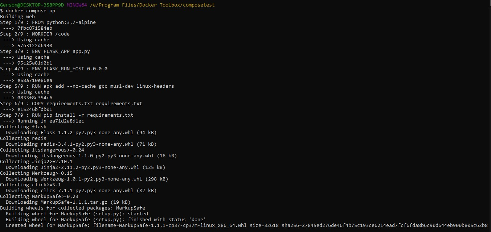

## Penjelasan Praktikum Teknologi Cloud Computing Minggu ke 08

1. Terlebih dulu membuat direktori baru untuk project dan kemudian masuk pada direktori tersebut, seperti pada gambar dibawah ini :

Perintah yang digunakan yakni :
* `mkdir composetest`
* `cd composetest`

2. Selanjutnya membuat file baru pada project dengan nama `app.py` file python ini akan menghubungkan ke jaringan redis yang nantinya dapat diakses. Dengan menambahkan script seperti pada gambar dibawah ini:

3. Kemudian membuat file `txt` dengan nama _requirements_ dan mengisihkan _script_ pada file tersebut, seperti dibawah ini:

4. Kemudian membuat file baru dengan nama `DockerFile` dan kemudian mengisihkan _script_ seperti dibawah ini:

Pada _script_ diatas akan berguna untuk mengeksekusi beberapa perintah yang berada pada beberapa file sebelumnya.

5. Dan kemudian untuk selanjutnya membuat file `yml`, dengan nama `docker-compose`. File ini akan berguna sebagai wadah untuk merujuk pada port 5000 yang nantinya dapat diakses. Seperti pada gambar dibawah ini:

_Script_ diatas merupakan _script_ yang akan menjadi layanan dengan menggunakan _port_ _default_ untuk `server web Flask 5000`.

6. Selanjutnya melakukan _running_ untuk project/direktori yang dibuat tadi dengan menggunakan `docker compose`, yang perintahnya yaitu `docker-compose up`, seperti pada gambar dibawah ini:

Ketika perintah `docker-compose up` dijalankan maka otomatis sever akan _runnig_, dimana setiap proses _running_ dilakukan maka akan otomatis merujuk pada _image docker_ dan kemudian merequest ke server redis.