## Penjelasan Praktikum Teknologi Cloud Computing Minggu ke 09

# Praktikum Teknologi Cloud Computing - Minggu 9 (Docker for Beginners - Linux)

1. Pada bagian yang pertama ini, akan melakukan clonning repo dari github dengan mengambil direktori linux_tweet_app. Perintah yang digunakan seperti pada gambar berikut:

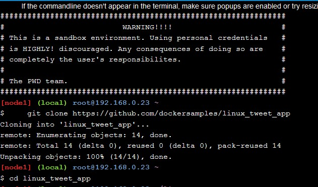

2. Apabila proses clonning berhasil dilakukan, maka langkah selanjutnya akses direktori yang baru di clone dan kemudian jalankan perintah untuk menajalankan _hostname_ melalui linux container yang berapa didalam folder alphine. Seperti pada gambar berikut:

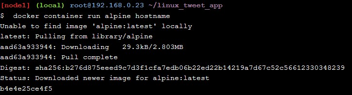

dari hasil _output_ di atas ini menunjukkan bahwa image alpine:latest terbaru tidak dapat ditemukan secara lokal. Ketika ini terjadi, Docker secara otomatis menariknya dari Docker Hub. sehingga ketika _image_ di pull, nama _host_ kontainer ditampilkan (b4e4e25ce4f5 seperti pada gambar diatas tersebut).

3. Kemudian melihat _list container_ yang tersedia, dengan menggunakan perintah seperti berikut:

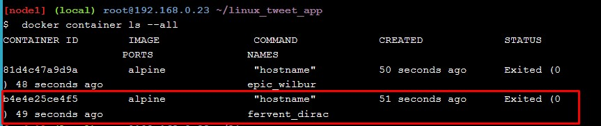

dimana seperti yang diberi _border_ warna merah adalah _cantainer_ dengan _hostname_ kita sedang running.

4. Kemudian selanjutnya melakukan _running container_ `ubuntu` dengan menggunakan perintah seperti berikut:

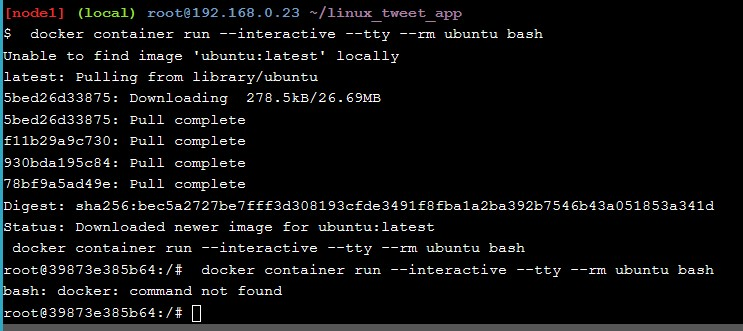

5. Selanjutnya menjalankan perintah seperti berikut didalam container `ubuntu`:

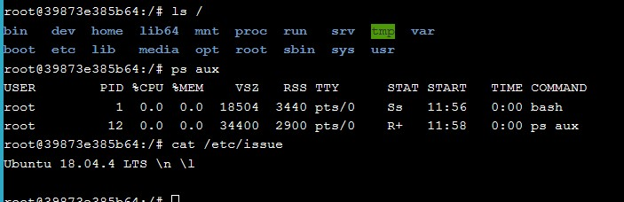

dimana `ls /` akan mencantumkan isi direktori root, ps aux akan menunjukkan proses yang berjalan, `cat / etc / issue` akan menunjukkan proses Linux yang sedang berjalan, dalam hal ini Ubuntu 18.04.3 LTS.
dan kemudian menjalankan perintah _exit_ untuk keluar dari _bash container_ seperti pada gambar berikut:

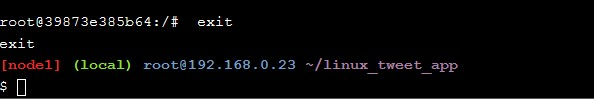

6. Kemudian selanjutnya menjalankan perintah untuk melihat _host_ yang sedang berjalan, seperti pada gambar berikut:

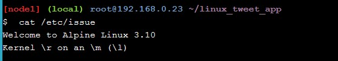

7. Kemudian mejalankan perintah untuk _running container_ MYSQL, seperti pada gambar berikut:

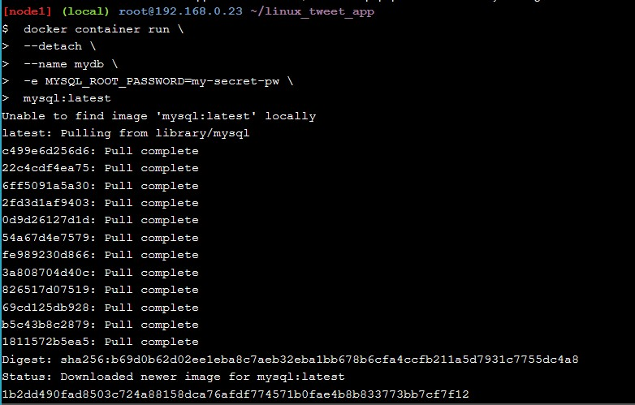

Sehingga _image container mysql_ akan berjalan pada `background`.

8. Selanjutnya melakukan cek _list_ untuk _container_ yang sedang berjalan, Seperti pada gambar berikut:

dimanan pada gambar diatas dapat dilihat bahwa _container image mysql_ sedang berjalan.

9. Kemudian melakukan cek terhadap _container_ kita yang sedang berjalan dalam folder, dengan menggunakan perintah seperti gambar berikut:

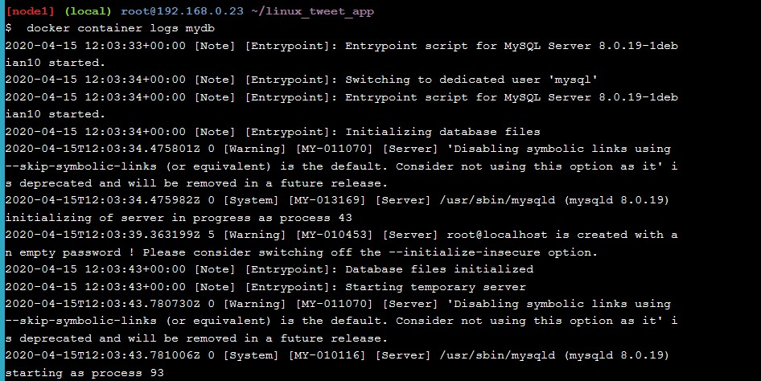

10. Selanjutnya melihat container yang sedang berjalan pada folder dengan perintah sebagai berikut:

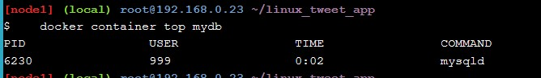

sehingga dapat dilihat bahwa `container mysql` sedang barjalan dalam folder.

11. Kemudian melihat versi `container mysql` yang sedang berjalan, dengan menggunakan perintah sebagai berikut:

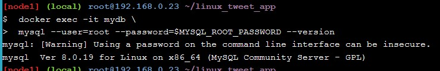

12. Selanjutnya melakukan koneksi `container docker` dengan `container mysq`l` yang sedang berjalan dan melakukan cek versi dengan menggunakan perintah _shell_ baru dalam folder _c_ontainer_ ini, selanjutnya menjalankan perintah _exit_ untuk keluar dari _folder container_. dengan menggunakan perintah sebagai berikut:

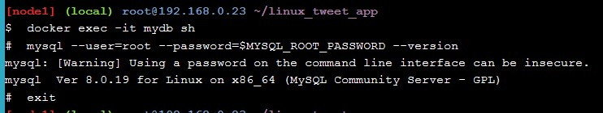

13. Membuat situs web sederhana dengan menggunakan _image_. Pada bagian pertama melakukan _check_ isi dari file `Dockerfile`, dengan menggunakan perintah berikut:

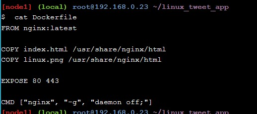

14. Selanjutnya mengunakan `Docker ID` kita untuk nantinya bisa membuat `image docker baru` kemudian menjalankan perintan `docker image build`, seperti perintah yang digunakan pada gambar berikut:

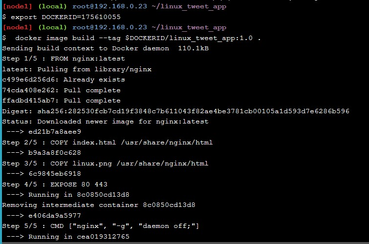

15. Untuk menjalankan `image container docker` menggunakan perintah seperti pada gambar berikut:

apabila proses tersebut berhasil, maka selanjutnya `image docker` dapat diakses di browser, dengan mengklik tautan seperti gambar berikut:

16. Tampilan web sederhana dari `image docker` yang dibuat, seperti pada gambar berikut:

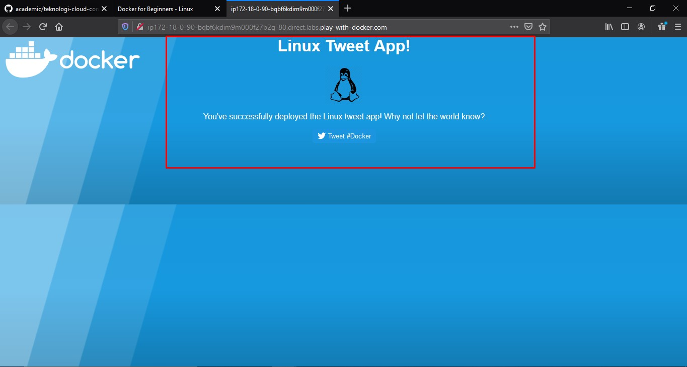

17. Apabila sudah melakukan akses ke situs web sederhana tersebut, selanjutnya mencoba untuk menonaktifkan dan _remove_ sementara web, dengan menggunakan perintah seperti pada gambar berikut:

18. Hasilnya ketika mengakses ulang web tersebut akan menampilkan halaman seperti pada gambar berikut:

Dikarenakan `image docker` yang dibuat menjadi web tadi sudah dinonaktifkan dan di `remove` sementara.

19. Kemudian melakukan modifikasi web dengan terlebih dahulu menjalankan web kembali, dikarenakan sebelumnya sudah dilakukan nonaktif dan di _remove_ sementara, perintah yang digunakan seperti pada gambar berikut:

20. Selanjutnya copy file `index.html` pada container, untuk perintahnya seperti pada gambar berikut:

21. Lakukan _refresh_ pada halaman web dan akan menampilkan seperti gambar berikut:

22. Kemudian memberhentikan container update kita dan kemudian menjalankan container versi sebelumnya yaitu 1.0. untuk perintahnya seperti pada gambar berikut:

23. Apabila kita melakukan _refresh_ ulang pada website, akan menampilkan halaman pada versi sebelumnya, seperti gambar dberikut: 

24. Kemudian melakukan `update image.` Dengan membuat _image_ baru dengan versinya yaitu 2.0. Perintah yang digunakan seperti pada gambar berikut:

25. Untuk melihat _list image_ yang berjalan, dengan menggunakan perintah seperti pada gambar berikut:

dimana dari gambar diatas sudah `host` untuk versi terbaru yang baru saja diupdate yaitu 2.0.

26. Melakukan _test_ untuk versi terbaru image, perintah yang digunakan seperti gambar berikut:

27. Melakukan `push image`  ke `docker hub.` untuk pertama melihat `list image` pada `docker host` seperti pada gambar berikut:

Terdapat 2 image yaitu versio 1.0 dan 2.0, kedua ini akan di _push_ ke `docker hub.`

28. Untuk melakukan push ke docker hub, sebelumnya harus melakukan login dengan akun docker, untuk perintahnya seperti pada gambar berikut:

login tersebut menggunakan ID dan Password. Apabila sudah melakukan login maka selanjutnya melakukan push image docker untuk versi 1.0 dan versi 2.0, dengan menggunakan perintah seperti berikut:

Terima kasih