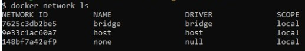
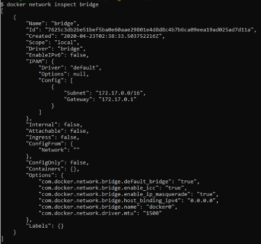

## Penjelasan Praktikum Teknologi Cloud Computing Minggu ke 10

# Praktikum Teknologi Cloud Computing - Minggu 10- Docker Networking

# Latihan

1. Pada bagian yang pertama kita akan menjalankan perintah utama untuk mengkonfigurasi dan mengelola jaringan kontainer, Seperti gambar berikut:

2. Selanjutnya menjalankan perintah untuk melihat jaringan kontainer yang ada pada _host Docker_ saat ini, Seperti gambar berikut:

3. Kemudian menggunakan perintah untuk melihat detail konfigurasi dari kontainer jaringan pada _docker host_ , Seperti gambar berikut:

Terima kasih