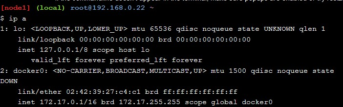
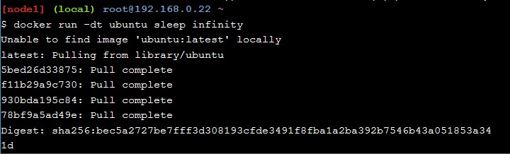
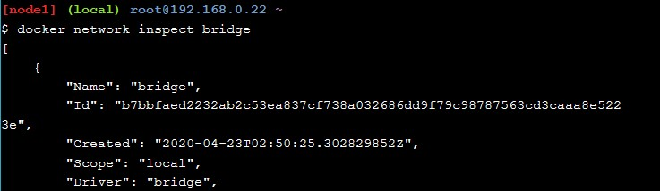
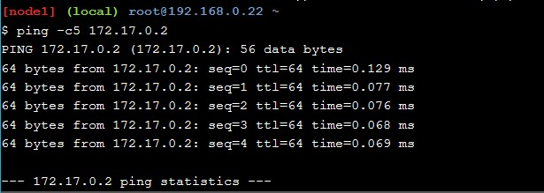

# Praktikum Teknologi Cloud Computing - Minggu ke 10 - Docker Networking

## 205611034 Danis Apriyanto

## Latihan dan Tugas

1. Pada bagian yang pertama kita akan menjalankan perintah utama untuk mengkonfigurasi dan mengelola jaringan kontainer, Seperti gambar berikut: `docker network`

    

2. Selanjutnya menjalankan perintah untuk melihat jaringan kontainer yang ada pada _host Docker_ saat ini, Seperti gambar berikut: `docker network ls`

    

3. Kemudian menggunakan perintah untuk melihat detail konfigurasi dari kontainer jaringan pada _docker host_ , Seperti gambar berikut: `docker network inspect bridge`

    

4. Menjalankan perintah untuk melihat daftar plugin jaringan, Seperti gambar berikut: `docker info`. 

    

5. Melihat jaringan penghubung pada daftar _docker host_ kita saat ini, seperti gambar berikut: `docker network ls`

    

6. Melakukan instalasi _brctl_ yang nantinya digunakan untuk mendaftar _bridges Linux_ di _host Docker_. Langkah-langkah seperti gambar berikut: `apk update` dan `apk add bridge`

    

    

    setelah itu menjalankan perintah untuk menampilakan _brctl_ apakah sudah terdapat _bridges_ yang berjalan pada _dcoker host_ seperti gambar berikut: `brctl show`

    

7. Menjalankan perintah untuk melihat detail _bridges docker_ yang sedang berjalan ketika ditampilkan pada perintah sebelumnya seperti gambar berikut: `ip a`

    

8. Membuat _container_ baru, Pembuatan _container_ baru ini berguna untuk dapat terhubung ke jaringan _bridges_ yang ada. seperti pada gambar berikut: `docker run -dt ubuntu sleep infinity`

    

9. Melihat _container_ baru yang dibuat tadi, _container_ baru ini bernama `ubuntu:lates`. Yang merupakan _image_ yang berkondisi _sleep_ tetapi sedang berjalan, seperti pada gambar  berikut: `docker ps`

    

10. Karena tidak ada jaringan yang ditentukan pada perintah _docker run_, kontainer secara otomatis akan ditambahkan ke jaringan _bridge_. Maka perlu melihat lagi _brctl_  seperti pada gambar berikut: `brctl show`

    

    hasil diatas _bridges docker0_ sudah terhubung. Bagian ini menghubungkan _bridges docker0_ ke _container_ yang baru saja dibuat.

11. Memeriksa ulang jaringan _bridges_ dengan perintah baru, seperti pada gambar berikut: `docker network inspect bridge`

    

    

12. Dari hasil sebelumnya dimana ip address yang didapatkan pada _bridges_ yaitu 172.17.0.2.Selanjutnya akan mencoba ping ke ip address tersebut untuk memastikan apakah sedang berjalan atau tidak, seperti pada gambar berikut: `ping -c5 172.17.0.2`

    

13. Selanjutnya melihat _ID bridges_ untuk nantinya dapat menghubungkan dengan URL lainnya, seperti pada gambar berikut: `docker ps`

    
    
    ID adalah 079ed538c950, id ini nantinya akan digunakan untuk menjalankan shell pada container ubuntu seperti pada gambar berikut:
    
    

    Dari gambar diatas sekaligus melakukan penginstalan program ping. Apabila sudah melakukan instalasi program ping maka selanjutnya kita mencoba ping ke url www.github.com. Untuk perintah dan hasilnya seperti pada gambar berikut:

    

    

    Selanjutnya keluar dari _running container_ tersebut, dengan menggunakan perintah seperti pada gambar berikut:

    

    Hasil pada gambar diatas lansung melakukan pemberhentian untuk kontainer yang sedang berjalan dengan ID kita, untuk perintahnya seperti gambar diatas tersebut.

14. Memulai kontainer baru dan sekaligus menjalankannya dimana kontainer ini bernama official NGINX. Dimana _image_ ini berjalan pada web server pada port 80. Untuk perintah dan hasilnya seperti pada gambar berikut: `docker run --name web1 -d -p 8080:80 nginx`

    

15. Kemudian melakukan cek status container dan _port_ yang sedang berjalan, dari hasil _start_ sebelumnya. Untuk perintah dan hasilnya seperti gambar berikut: `docker ps`

    

16. Menghubungkan _host docker_ dengan port 80, apabila tidak dapat membukanya pada web browser. Untuk perintah dan hasilnya seperti pada gambar berikut: `curl 127.0.0.1:8080`

    

    

Terima kasih