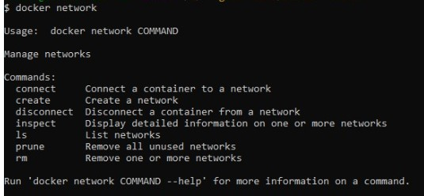
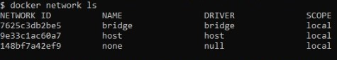
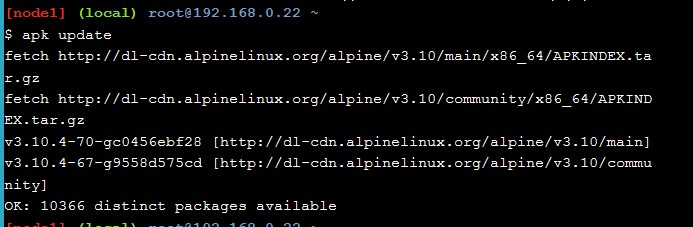
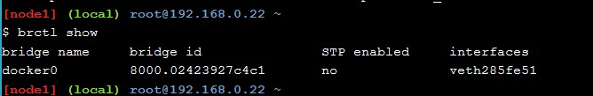

## Praktikum Teknologi Cloud Computing - Minggu ke 10 - Docker Networking

# 205611034 Danis Apriyanto

# Latihan dan Tugas

1. Pada bagian yang pertama kita akan menjalankan perintah utama untuk mengkonfigurasi dan mengelola jaringan kontainer, Seperti gambar berikut: `docker network`

    

2. Selanjutnya menjalankan perintah untuk melihat jaringan kontainer yang ada pada _host Docker_ saat ini, Seperti gambar berikut: `docker network ls`

    

3. Kemudian menggunakan perintah untuk melihat detail konfigurasi dari kontainer jaringan pada _docker host_ , Seperti gambar berikut: `docker network inspect bridge`

    

4. Menjalankan perintah untuk melihat daftar plugin jaringan, Seperti gambar berikut: `docker info`. 

    

5. Melihat jaringan penghubung pada daftar _docker host_ kita saat ini, seperti gambar berikut: `docker network ls`

    

6. Melakukan instalasi _brctl_ yang nantinya digunakan untuk mendaftar _bridges Linux_ di _host Docker_. Langkah-langkah seperti gambar berikut: `apk update` dan `apk add bridge`

    

    

setelah itu menjalankan perintah untuk menampilakan _brctl_ apakah sudah terdapat _bridges_ yang berjalan pada _dcoker host_ seperti gambar berikut: `brctl show`

    

7. Menjalankan perintah untuk melihat detail _bridges docker_ yang sedang berjalan ketika ditampilkan pada perintah sebelumnya seperti gambar berikut: `ip a`

    

8. Membuat _container_ baru, Pembuatan _container_ baru ini berguna untuk dapat terhubung ke jaringan _bridges_ yang ada. seperti pada gambar berikut: `docker run -dt ubuntu sleep infinity`

    

9. Melihat _container_ baru yang dibuat tadi, _container_ baru ini bernama `ubuntu:lates`. Yang merupakan _image_ yang berkondisi _sleep_ tetapi sedang berjalan, seperti pada gambar  berikut: `docker ps`

    

10. Karena tidak ada jaringan yang ditentukan pada perintah _docker run_, kontainer secara otomatis akan ditambahkan ke jaringan _bridge_. Maka perlu melihat lagi _brctl_  seperti pada gambar berikut: `brctl show`

    

hasil diatas _bridges docker0_ sudah terhubung. Bagian ini menghubungkan _bridges docker0_ ke _container_ yang baru saja dibuat.

Terima kasih