## Praktikum Teknologi Cloud Computing - Minggu 11 (Application Containerization & Microservice Orchestration)

## 205611034 Danis Apriyanto

1. Melakukan _clonning_ repo dari git dan mengakses direktori, serta memeriksa _branch_ dari repo tersebut.

    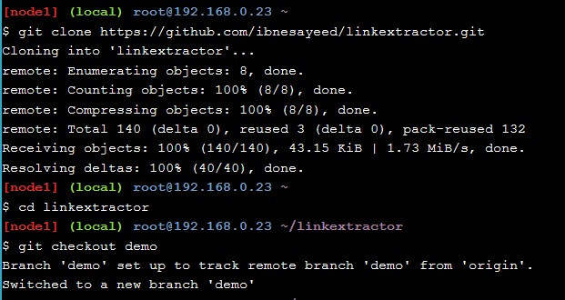

2. Kemudian memeriksa `branch step0` untuk melihat file didalamnya. Dan kemudian melihat isi dari file `python linkextractor`.

    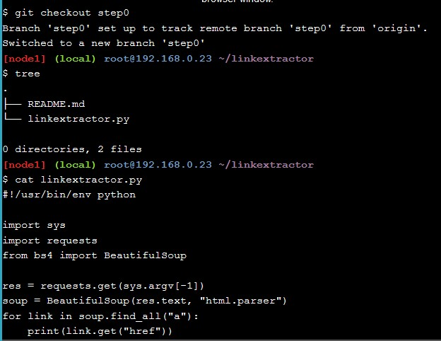

3. Menjalankan file `linkextractor.py.`

    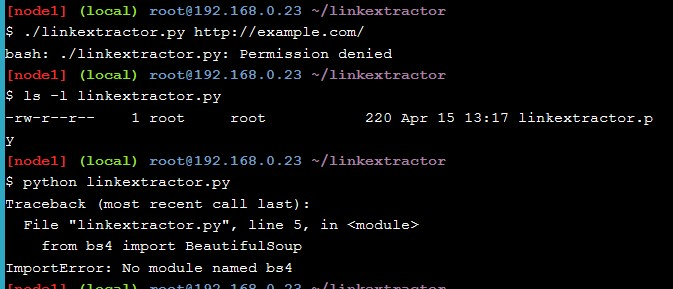

4. Memeriksa _branch step1_ untuk melihat file didalamnya.

    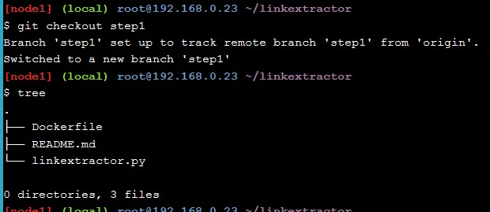

5. Kemudian melihat isi dari file `Dockerfile`

    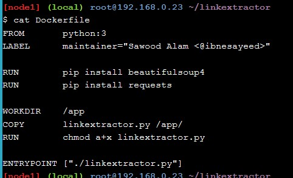

6. Membangun _docker image_ kita, dengan menjalankan perintah seperti gambar berikut dan sekaligus manghasilkan outputnya.

    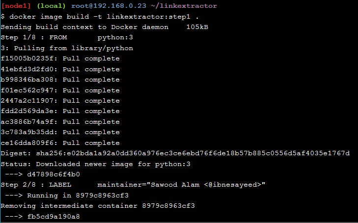

    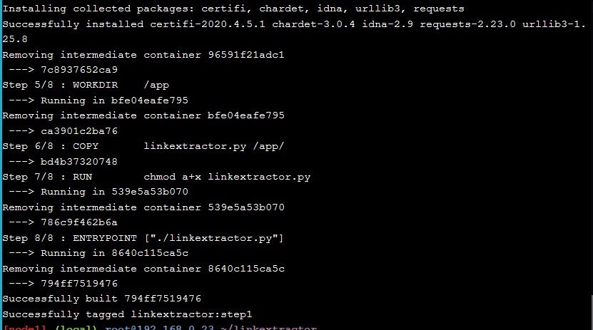

7. Selanjutnya membuat _docker image_ bernama _linkextractor: step1_ selanjutnya kroscek dengan melihat daftar/list dari _image docker_ yang sudah ada. Dan melakukan ekstrak docker image kita dengan mendapat URL

    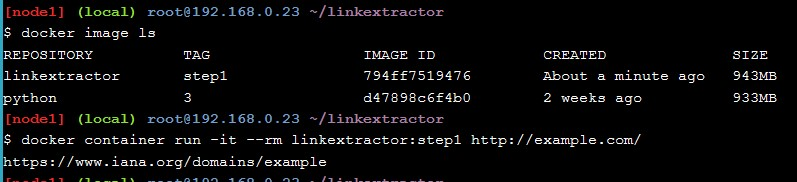

Gambar berikut merupakan _output_ apabila kita mengakses alamat URL tersebut.

    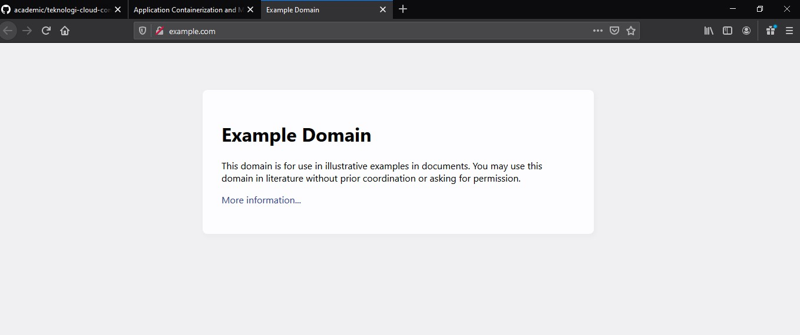

8. Kemudian melakukan percobaan pada halaman web untuk melihat lebih banyak tautan.

    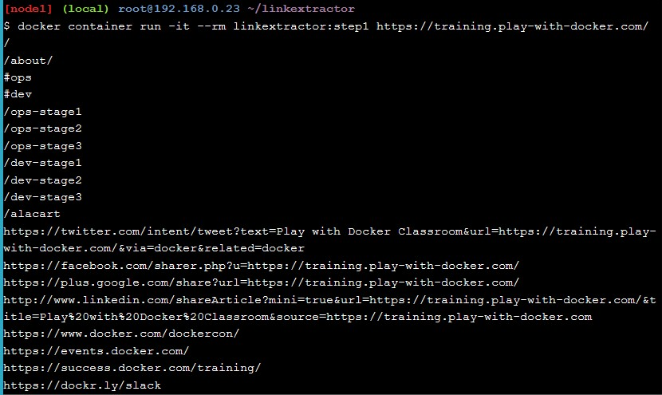

9. Dan memeriksa _branch_ step 2 dan daftar file yang ada di dalamnya.

    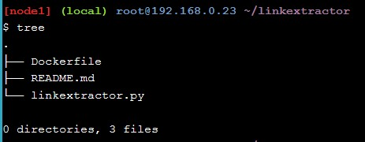

10. Secara otomatis file `linkextractor.py` akan diupdate, berikut merupakan hasil _update_ dari file tersebut.

    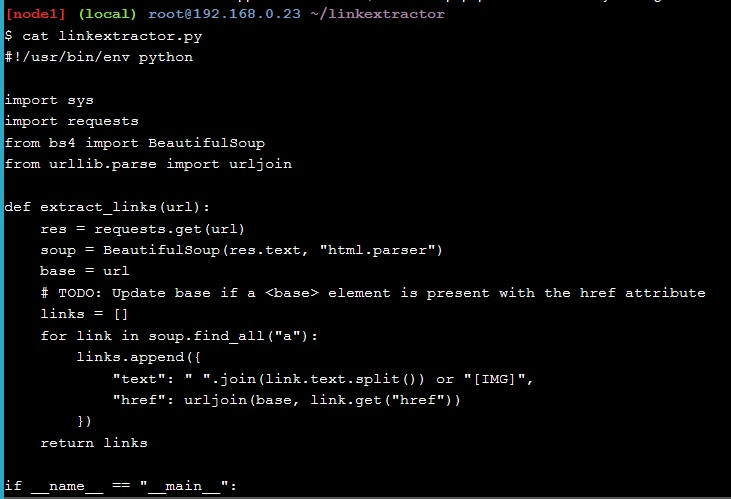

11. Selanjutnya membuat _image_ baru

    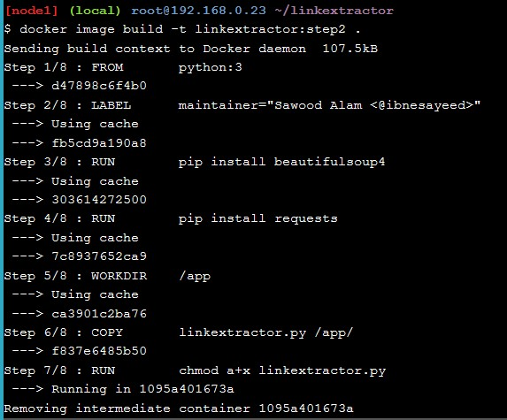

12. Hasilnya _image docker_ yang baru dibuat dengan nama `linkextractor:step02` kita cek pada pada _list image docker_ yang sudah ada.

    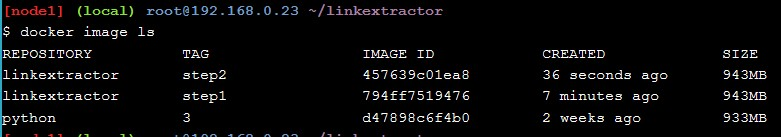

13. Menjalankan _image docker_ tersebut dan menghasilkan _out put_ seperti gambar berikut:

    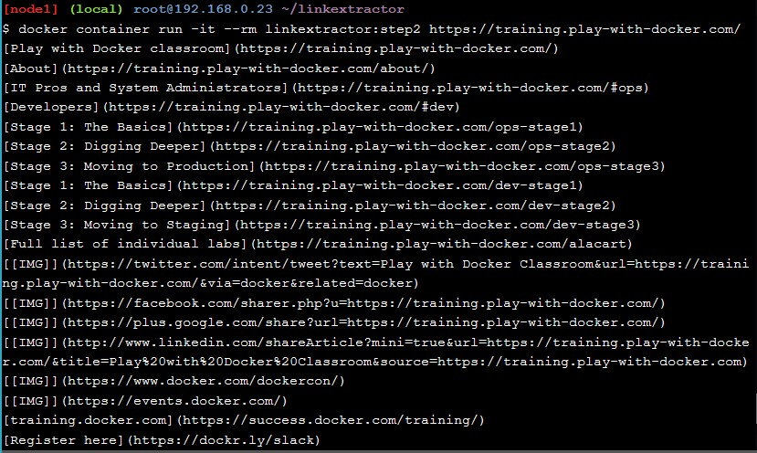

14. Kemudian menjalankan `image docker step1` yang sebelumnya dan menghasilkan keluaran yang masih sama seperti gambar berikut:

    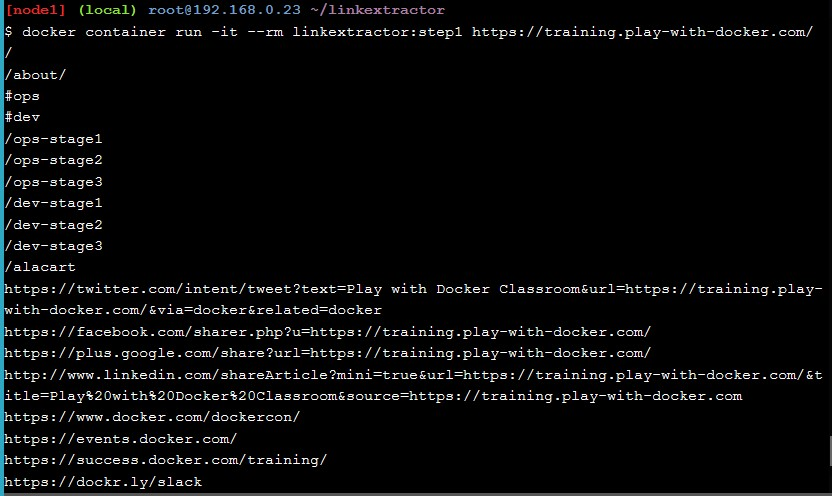

15. Memeriksa `branch step3` dan isi file didalamnya.

    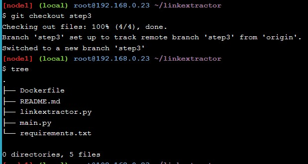

16. Kroscek `Dockerfile` untuk melihat perubahannya.

    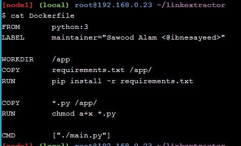

17. Kemudian melihat isi dari file `main.py` yang baru ditambahkan tersebut.

    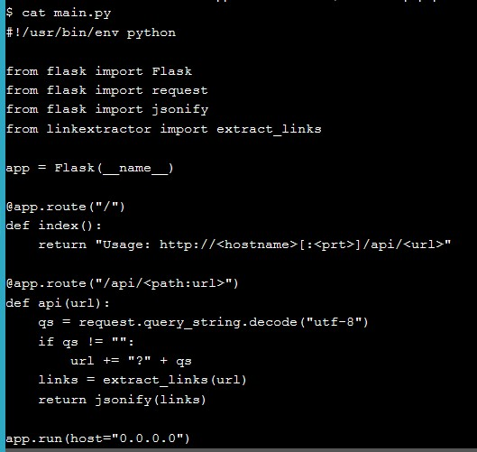

18. Kemudian _update_ `image docker step3` ini dengan beberapa langkah perubahan, seperti gambar berikut.

    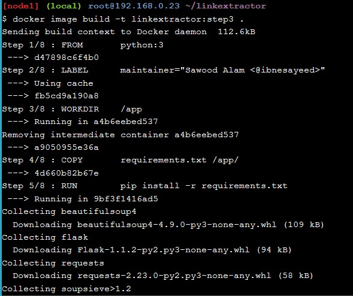

    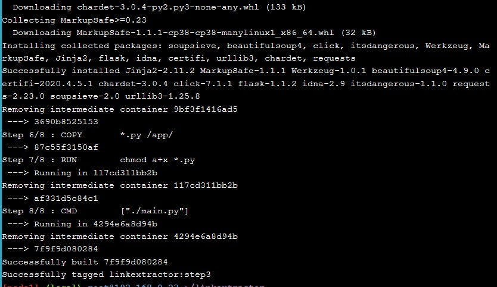

19. Menjalankan _container_ dalam mode (-d flag) sehingga terminal dapat tersedia untuk perintah yang lain saat _container_ masih berjalan. 

Perhatikan juga bahwa disitu terdapat port 5000 dari _container_ dengan host 5000 (menggunakan perintah -p 5000: 5000) agar dapat diakses dari host. Dan juga memberikan nama (--name = linkextractor) ke _container_ untuk lebih mudah melihat log atau menghapus _container_. Serta melihat list _image container_ yang baru dibuat tersebut.

    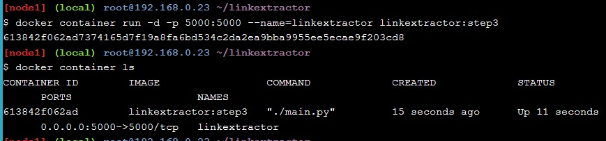    

20. Membuat permintaan HTTP dalam bentuk `/api/url` untuk mengakses server ini dan mengambil respons berisi link yang diekstrak.

    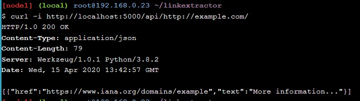

21. Karena container berjalan dalam mode terpisah, jadi tidak dapat melihat proses yang terjadi di dalam. Tetapi dapat melihat _log_ menggunakan `linkextractor` yang di tetapkan untuk _container_. Serta menghapus _image container_ ini.

    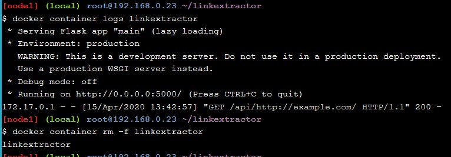

22. Selanjutnya memeriksa `branch step4` dan isi file didalamnya.

    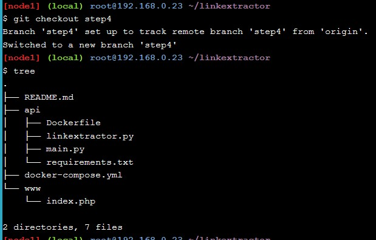

23. Melihat isi dari file `docker-compose.yml` dan `www/index.php`.

    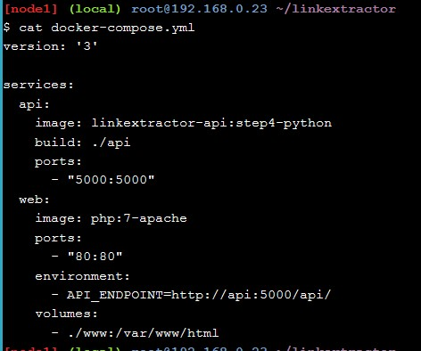

