## Praktikum Teknologi Cloud Computing - Minggu 11 (Application Containerization & Microservice Orchestration)

## 205611034 Danis Apriyanto

1. Melakukan _clonning_ repo dari git dan mengakses direktori, serta memeriksa _branch_ dari repo tersebut.

    

2. Kemudian memeriksa `branch step0` untuk melihat file didalamnya. Dan kemudian melihat isi dari file `python linkextractor`.

    

3. Menjalankan file `linkextractor.py.`

    

4. Memeriksa _branch step1_ untuk melihat file didalamnya.

    

5. Kemudian melihat isi dari file `Dockerfile`

    

6. Membangun _docker image_ kita, dengan menjalankan perintah seperti gambar berikut dan sekaligus manghasilkan outputnya.

    

    

7. Selanjutnya membuat _docker image_ bernama _linkextractor: step1_ selanjutnya kroscek dengan melihat daftar/list dari _image docker_ yang sudah ada. Dan melakukan ekstrak docker image kita dengan mendapat URL

    

    Gambar berikut merupakan _output_ apabila kita mengakses alamat URL tersebut.

    

8. Kemudian melakukan percobaan pada halaman web untuk melihat lebih banyak tautan.

    

9. Dan memeriksa _branch_ step 2 dan daftar file yang ada di dalamnya.

    

10. Secara otomatis file `linkextractor.py` akan diupdate, berikut merupakan hasil _update_ dari file tersebut.

    

11. Selanjutnya membuat _image_ baru

    

12. Hasilnya _image docker_ yang baru dibuat dengan nama `linkextractor:step02` kita cek pada pada _list image docker_ yang sudah ada.

    

13. Menjalankan _image docker_ tersebut dan menghasilkan _out put_ seperti gambar berikut:

    

14. Kemudian menjalankan `image docker step1` yang sebelumnya dan menghasilkan keluaran yang masih sama seperti gambar berikut:

    

15. Memeriksa `branch step3` dan isi file didalamnya.

    

16. Kroscek `Dockerfile` untuk melihat perubahannya.

    

17. Kemudian melihat isi dari file `main.py` yang baru ditambahkan tersebut.

    

18. Kemudian _update_ `image docker step3` ini dengan beberapa langkah perubahan, seperti gambar berikut.

    

    

19. Menjalankan _container_ dalam mode (-d flag) sehingga terminal dapat tersedia untuk perintah yang lain saat _container_ masih berjalan. 

    Perhatikan juga bahwa disitu terdapat port 5000 dari _container_ dengan host 5000 (menggunakan perintah -p 5000: 5000) agar dapat diakses dari host. Dan juga memberikan nama (--name = linkextractor) ke _container_ untuk lebih mudah melihat log atau menghapus _container_. Serta melihat list _image container_ yang baru dibuat tersebut.

        

20. Membuat permintaan HTTP dalam bentuk `/api/url` untuk mengakses server ini dan mengambil respons berisi link yang diekstrak.

    

21. Karena container berjalan dalam mode terpisah, jadi tidak dapat melihat proses yang terjadi di dalam. Tetapi dapat melihat _log_ menggunakan `linkextractor` yang di tetapkan untuk _container_. Serta menghapus _image container_ ini.

    

22. Selanjutnya memeriksa `branch step4` dan isi file didalamnya.

    

23. Melihat isi dari file `docker-compose.yml` dan `www/index.php`.

    

24. Membuat mode terpisah untuk _container_.

    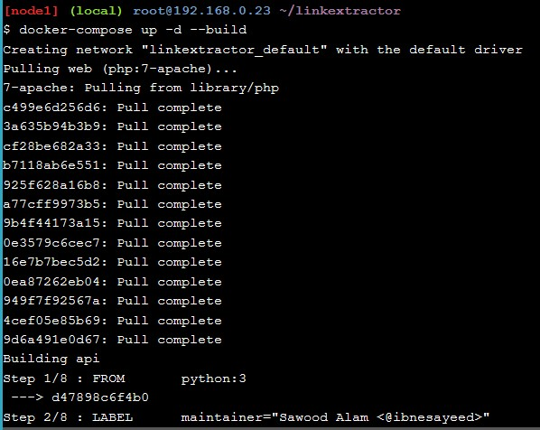

    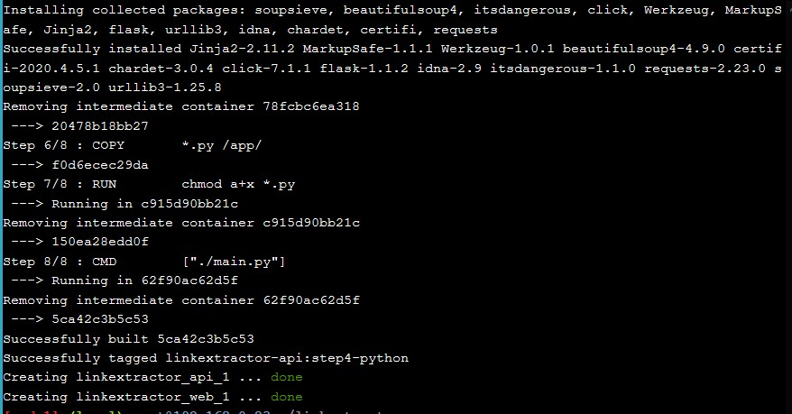

25. Memeriksa daftar _container_ yang sedang berjalan serta memastikan bahwa kedua _container_ tersebut dapat berjalan dan mengkases layanan API.

    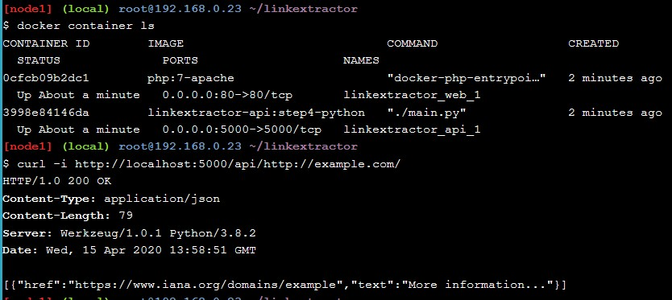

    Sehingga ketika megkasesnya pada URL, maka hasilnya seperti pada gambar berikut:

    

26. Kemudian modifikasi file www/index.php mengganti semua kemunculan Link _Extractor_ dengan Super Link _Extractor_. Kemudian mengembalikan perubahan, dan menonaktifkan _container_ berikut.

    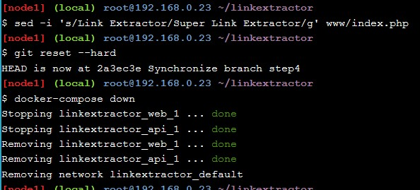

27. Kemudian memeriksa _branch step5_ dan melihat isi file didalamnya.

    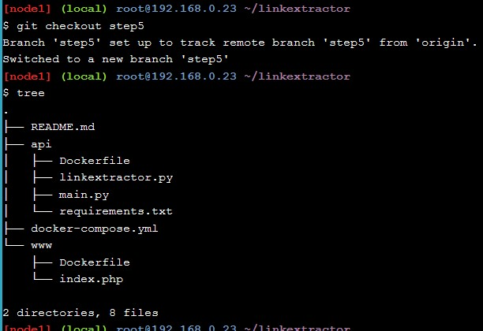

28. Memeriksa file Dockerfile yang baru di dalam direktori `cat www/Dockerfile`

    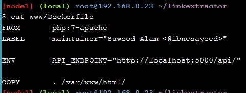

29. Selanjutnya, melihat isi file `api/main.py` dengan menggunakan server redis.

    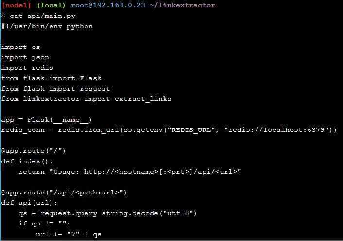

30. Melihat hasil perubahan pada file `docker-compose.yml.`

    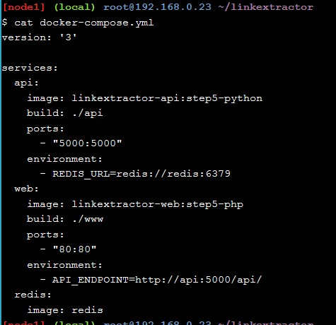

31. Selanjutnya melakukan eksekusi container ini, untuk bisa di buka pada browser.

    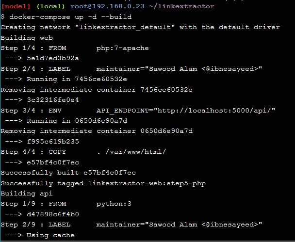

    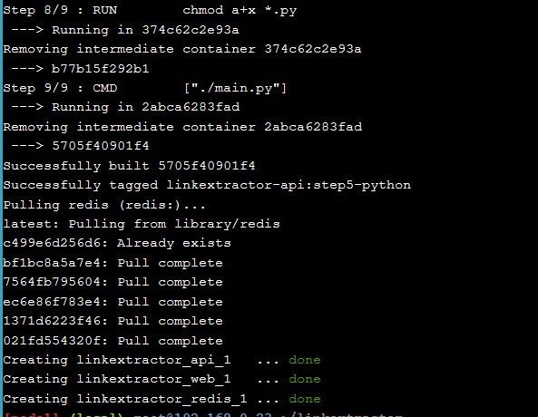

    Sehingga hasilnya ketika ditampilkan pada browser, seperti pada gambar berikut:

    

32. Selanjutnya memeriksa apakah layanan redis dipakai atau tidak.

    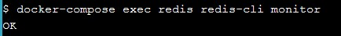

33. Memeriksa ketika folder _www_ tidak tersedia pada _container_ yang sedang berjalan. kemudian melakukan verifikasi bahwa perubahan yang dibuat secara lokal tidak berada dalam layanan yang berjalan dengan memuat ulang halaman web dan kemudian mengembalikan perubahan. Dan menonaktifkan cointainer berikut.

    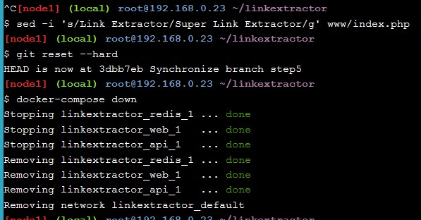    

34. Selanjutnya memeriksa _branch step6_ dan melihat isi file didalamnya.

    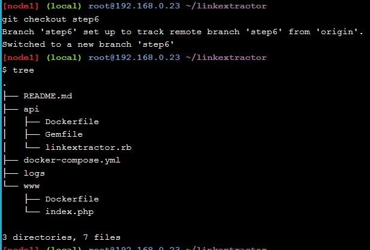

35. Selanjutnya melihat isi file `linkextractor.rb` ini merupakan file _ruby_ untuk mengelola _dependency_. Kemudian juga melihat isi file `Dockerfile`.

    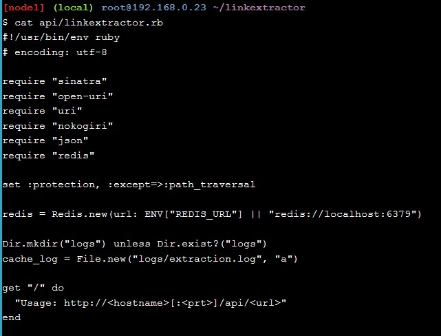

    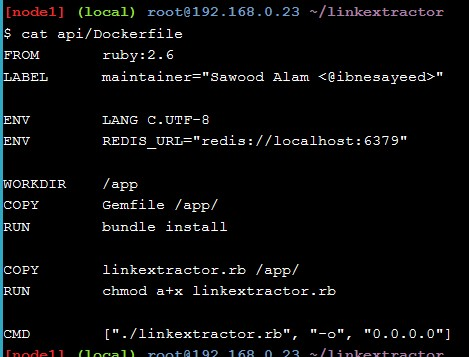

36. Kemudian mengecek perubahan pada file `docker-compose.yml.`

    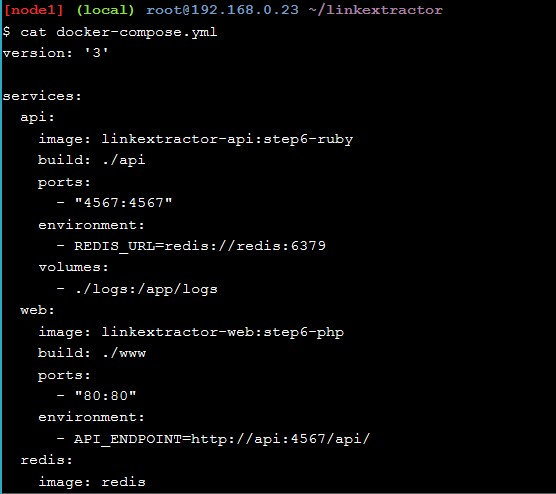

37. Kemudian selanjutnya mengeksekusi container ini.

    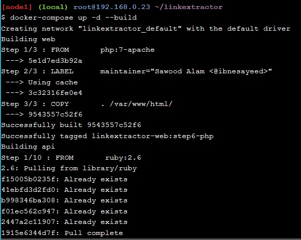

    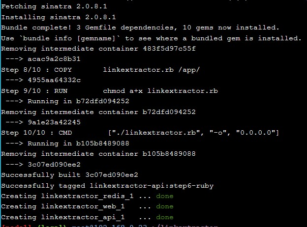

    Selanjutnya harus dapat mengakses API (menggunakan nomor port yang diperbarui):

    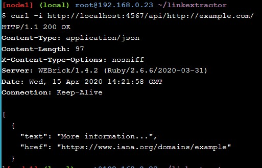

    Hasil yang ditampilkan pada halaman browser seperti gambar berikut:

    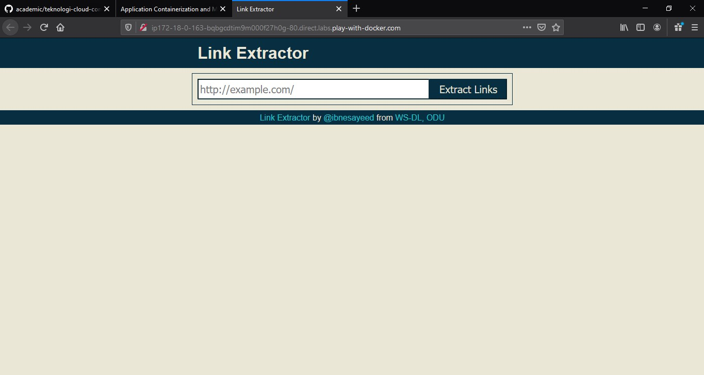

38. Kemudian _shut down container_ ini tetapi _log_ akan tetap ada, walaupun _container_ akan hilang.

    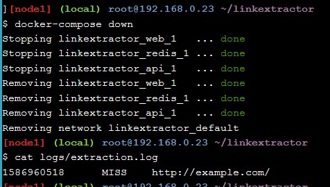

Terima kasih

