## Praktikum Teknologi Cloud Computing - Minggu 12 (Docker Orchestration Hands-on Lab)

## 205611034 Danis Apriyanto

1. Membuat _container_ baru yang dijalankan pada node 1. 
    Dengan menggunakan perintah seperti gambar berikut,

    `docker run -dt ubuntu sleep infinity`

    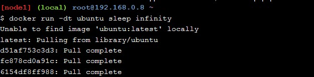

    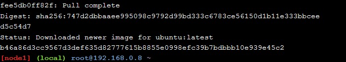

    Perintah tersebut berguna untuk membuat _container_ baru. _Container_ ini akan tetap berjalan pada _background image docker_ saat _sleep_.

2. Untuk mastikan bahwa container yang baru dibuat tersebut sudah berjalan pada node 1. Dengan menggunakan perintah seperti gambar berikut,

    `docker ps`

    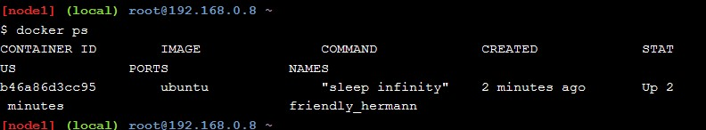

3. Menginisialisasi _Swarm_ baru kemudian _join_ dengan _single node_ dan melakukan verifikasi apabila operasi berhasil. Dengan menggunakan perintah seperti gambar berikut,

    `docker swarm init --advertise-addr $(hostname -i)`

    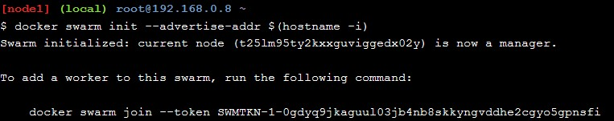

    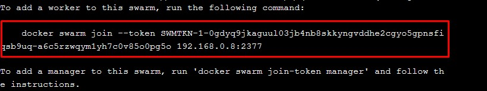

    hasil pembuatan _docker swarm_ baru tersebut akan mendapatkan token yang nantinya digunakan untuk _join node_ yang lain.
    
    Selanjutnya melakukan verifikasi pada node 1 apabila telah berhasil melakukan konfigurasi _manager node swarm_. Dengan menjalankan perintah seperti gambar berikut,

    `docker info`

    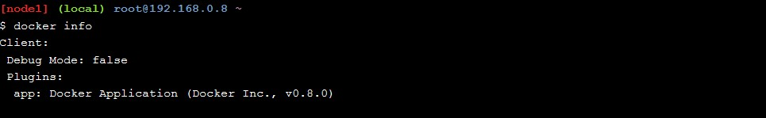

4. Melakukan join swarm untuk _node 2_ dan _node 3_ dengan menggunakan token yang didapat dari pembuatan _swarm_ baru sebelumnya.

    node 2

    `docker swarm join \`

    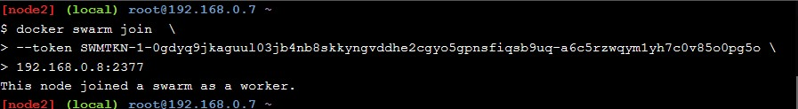    

    node 3

    `docker swarm join \`

    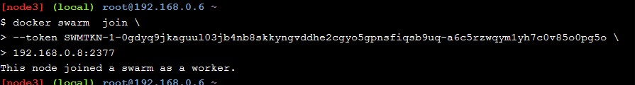

5. Setelah melakukan _join_ node2 dan node3, kemudian kembali ke node1, dan jalankan perintah `docker node ls` untuk memverifikasi bahwa kedua node tersebut sudah _join_ ke _Swarm_. Seperti pada gambar berikut,

    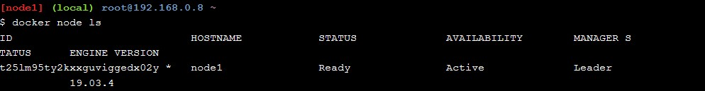    

    

6. Kemudian dari node 1 akan dilakukan _deploy sleep_ pada _docker swarm_. _Deploy_ Ini merupakan layanan dari _docker swarm_.

    `docker service create --name sleep-app ubuntu sleep infinity`

    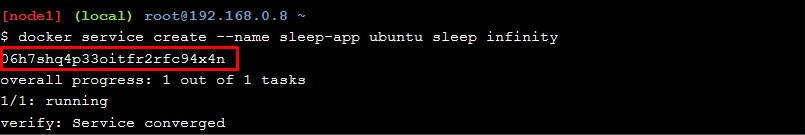

    Selanjutnya verifikasi bahwa pembuatan _service_ telah diterima oleh _Swarm manager_. Seperti perintah dan hasilnya pada gambar berikut,

    `docker service ls`

    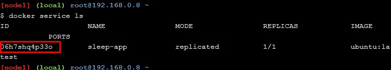

7. Melakukan replika pada _container_ sampai sleep-app ke 7, ini berguna untuk mendeskripsikan _container_ pada layanan _service_. Seperti pada perintah dan hasilnya pada gambar berikut,

    `docker service update --replicas 7 sleep-app`

    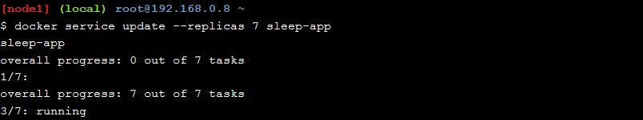

    

    Selanjutnya melihat replika container yang dibuat secara real-time.

    `docker service ps sleep-app`

    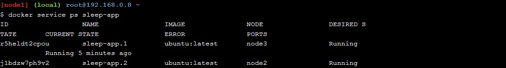

    

    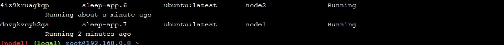

    Hasilnya ada 7 container yang berjalan.

8. Melakukan replika layanan kembali menjadi hanya 4 kontainer dengan melakukan pembaruan layanan _docker container_. Seperti pada perintah dan hasilnya berikut,

    `docker service update --replicas 4 sleep-app sleep-app`

    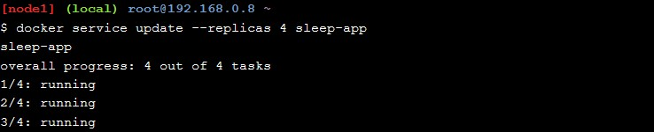

    

    replika diatas sudah menghasilkan 4 container yang sedang berjalan.
    Kemudian melakukan verifikasi dari hasil replika container diatas, dengan menggunakan perintah seperti pada gambar berikut,

    `docker service ps sleep app`

    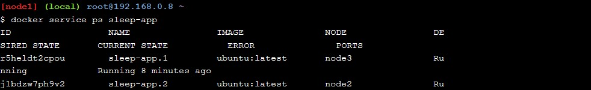

    

     hasilnya terlihat hanya 4 container docker yang sedang berjalan pada slepp-app.

9. Kroscek status _node_ yang sedang berjalan pada node 1. Dengan menggunakan perintah seperti pada gambar berikut,

    `docker node ls`

    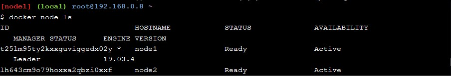

    

10. Melihat _container_ yang sedang berjalan pada node 2

    `docker ps`

    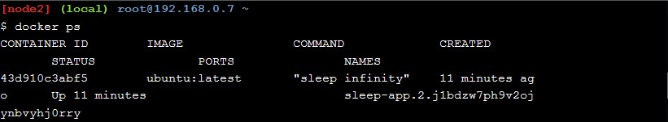 

11. Kembali ke node 1 untuk mengambil node 2 dari layanan service. Dengan menjalankan perintah seperti pada gambar berikut,

    `docker node ls`

    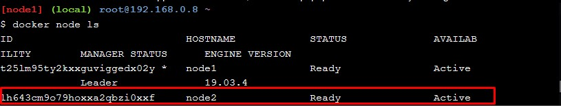

    hasil diatas, id node 2 akan digunakan untuk melakukan _drain_ untuk menggantikan node kita dengan node 2. Seperti pada gambar berikut,

    `docker node update --availability drain lh643cm9o79hoxxa2qbzi0xxf`

    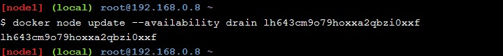

    Kemudian cek satatus node, dengan menggunakan perintah seperti pada gambar berikut,

    `docker node ls`

    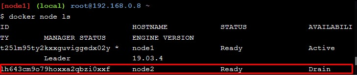

12. Kembali ke node 2, dan jalankan perintah seperti gambar berikut,

    `docker ps`

    

    hasilnya container pada node 2 sudah tidak berjalan lagi.

13. Kroscek ulang pada node 1, bahwa container sudah dijadwal ulang dengan melihat bahwa hanya ada 4 coinaer yang sedang berjalan. Sedangkan node 2 tidak, seperti pada gambar berikut

    `docker service ps sleep-app`
    
    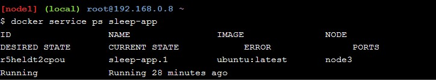
    
    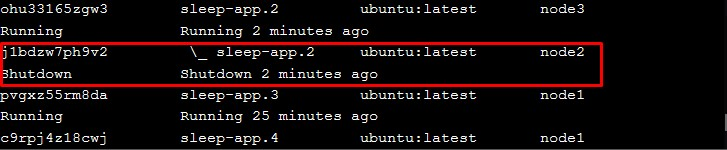

14. Menghapus layanan service pada node 1 dengan menggunakan perintah seperti gambar berikut,

    `docker service rm sleep-app`

    

15. Menjalankan perintah docker ps pada node 1 untuk melihat daftar container yang sedang berjalan seperti gambar berikut,

    `docker ps`

    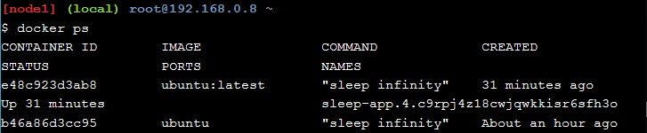

    kemudian melakukan kill container. Seperti pada gambar berikut,

    `docker kill b46a86d3cc95`

    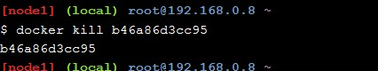

Terima kasih