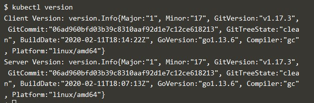

## Praktikum Teknologi Cloud Computing - Minggu 13 (Cluster Kubernetes)

## 205611034 Danis Apriyanto

1. Membuat Cluster baru Kubernetes `minikube version`

    

    Dari gambar diatas, jika ingin membuat sebuah _cluster kubernetes_ langkah pertama harus menjelankan minikube version. Selanjutnya baru menjalankan _cluster kubernetes_ dengan _minikube_.

2. Melihat versi _cluster_ yang baru dibuat `kubect1 version`

    

3. Melihat detail _cluster kubernetes_ yang dibuat dan melihat node dari _cluster_ berikut, `kubect1 cluster-info`

    

Terima kasih