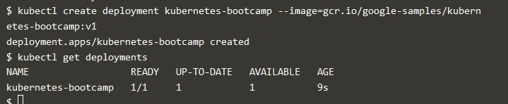
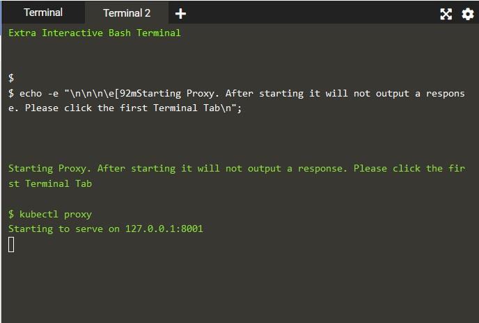
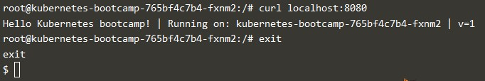
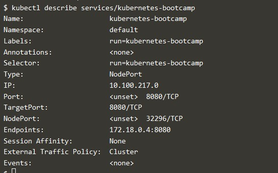

## Praktikum Teknologi Cloud Computing - Minggu 13 (Cluster Kubernetes)

## 205611034 Danis Apriyanto

1. Membuat Cluster baru Kubernetes `minikube version`

    

    Dari gambar diatas, jika ingin membuat sebuah _cluster kubernetes_ langkah pertama harus menjelankan minikube version. Selanjutnya baru menjalankan _cluster kubernetes_ dengan _minikube_.

2. Melihat versi _cluster_ yang baru dibuat `kubect1 version`

    

3. Melihat detail _cluster kubernetes_ yang dibuat dan melihat node dari _cluster_ berikut, `kubect1 cluster-info`

    

4. Mendeploy app.

    Pertama kita kroscek, apakah kubect1 terkonfigurasi dengan sluter atau tidak? `kubect version`

    

5. Kemudian menampikan node dari cluster `kubect1 get nodes`

    

6. Melakukan deploy app dan melihat _list_ hasil deploy app, dengan menjalankan perintah seperti gambar berikut, `kubect1 create deployment kubernetes-bootcamp --image-grc.io/google-samples/kubernetes-bootcamp:v1`

    

7. Membuka halaman terimnal baru dan menjalankan server _proxy_ `kubect1 proxy`

    

     gambar diatas menampilkan bahwa _proxy_ berjalan pada host 127.0.0.1:8001 atau localhost:8001.

8. Melihat API yang di _hosting_ pada server proxy dengan menggunakan versi API yang didapatkan yaitu curl. `curl http://localhost:8001/bersion`

    

9. Selanjutnya membuat variabel POD_NAME untuk menyimpan nama POD. `eksport POD_NAME=$(kubect1 get pods -o go-template --template '{{range .items}}{metadata.name}}{{"\n"}}{end}}')`

    `echo Name of the Pod: $POD_NAME`

    

10. Explore Aplikasi

    Melakukan kroscek konfigurasi aplikasi yang sudah dideploy dan melihat deskripsi container dan image apa yang berjalan pada pod.    

    kubect1 get pods

    

11. Menjalankan kembali server _proxy_ di terminal baru.

    

12. Kita akan mendapatkan POD dengan request POD melalui proxy

    

13. Melihat hasil aplikasi, prosesnya request ke curl dan mengambil log untuk container POD `kubect1 logs $POD_NAME`

    

14. Setelah POD aktif dan _running_, selanjutnya menjalankan perintah dengan menggunakan POD sebagai parameter pada _container_ untuk membuat _environment variabel_. `kubect1 exec $POD_NAME env`

        

15. Memulai _bash_ pada container POD dan sekaligus melakukan cek file yang menyimpan _source code app_ NodeJS pada container. `kubect1 exec -ti $POD_NAME bash`

    

16. Melakukan cek _curl_ apakah app berjalan didalamnya, kemudian _exit_ untuk keluar dari _bash container_.

    

17. Membuat _Service_ baru
    Pertama melakukan cek configurasi aplikasi yang sudah dideploy, kemudian mendaftarkan/membuat _service_ dan deploy _service_ untuk melihat hasil _deploy service_.

    `kubect1 get pods`
    
    `kubect1 get services`

    `kubect1 expose deployment/Kubernetes-bootcamp --type-"NodePort" --port 8080 service/kubernetes-bootcamp exposed`

     `kubect1 get services`

    

18. Melihat keseluruhan dari service. `kubect1 describe services/kubernetes-bootcamp`

    

Terima kasih